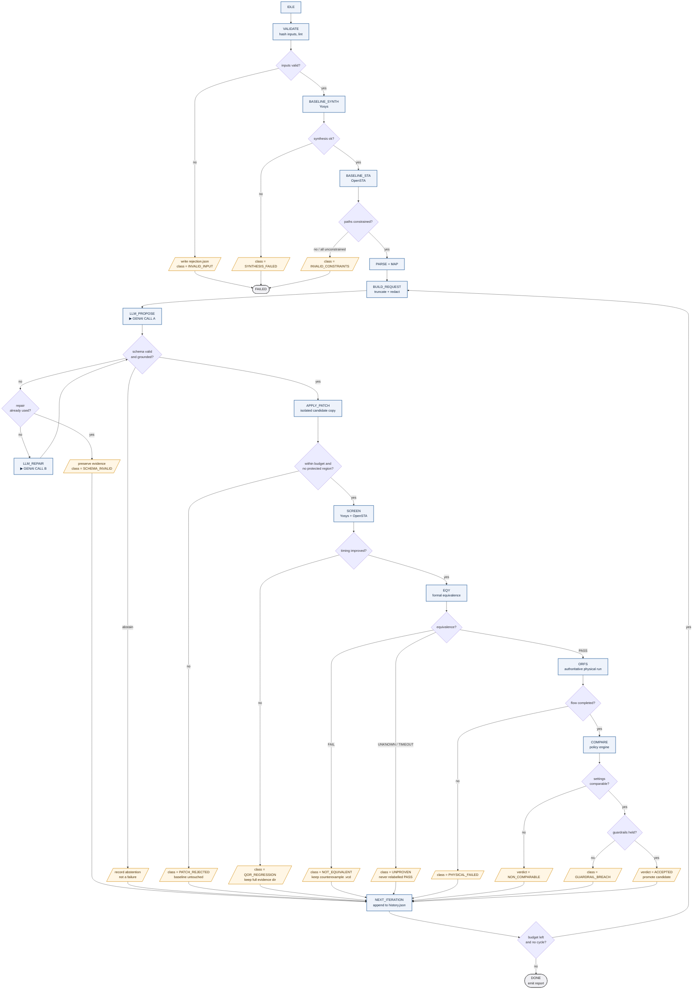
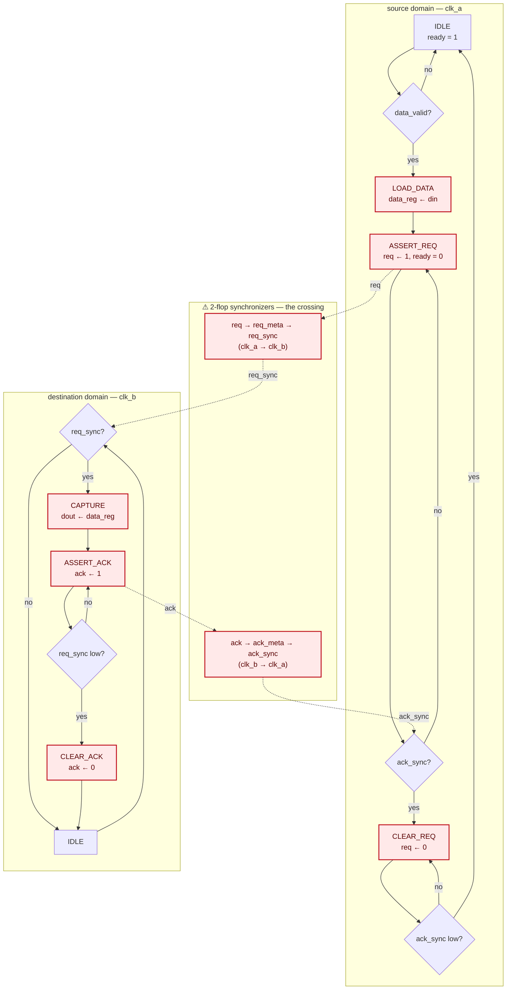
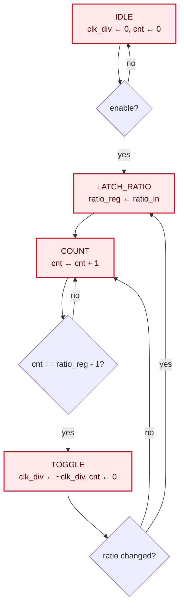

# Nebula — File Workflow

**What this document is:** the file-level dataflow of the Nebula system. Not "who owns what" (that is
[the development guide](./Nebula_project_development_guide.md) §3) and not "what the schemas contain"
(that is guide §4.2). This document answers the one question a builder has to answer before writing any code:

> **Which file, produced by which tool, is consumed by which next tool — and why does that file need to exist at all?**

Every stage below names real filenames on disk. If a file is not listed here, the orchestrator does not
create it. If it is listed here, some downstream stage reads it, and the "Why" column says which one.

Companion documents: [abstract](./Nebula_abstract.md) · [development guide](./Nebula_project_development_guide.md) · [project memory](./Nebula_project_memory.md)

---

## Contents

1. [Input inventory — what the human actually puts in](#1-input-inventory)
2. [The file journey — stage by stage](#2-the-file-journey)
3. [What a run directory looks like](#3-what-a-run-directory-looks-like)
4. [When GenAI is called](#4-when-genai-is-called)
5. [File-flow diagram](#5-file-flow-diagram)
6. [ASM chart — the orchestrator](#6-asm-chart--the-orchestrator)
7. [ASM chart — the benchmark RTL](#7-asm-chart--the-benchmark-rtl)
8. [Failure paths](#8-failure-paths)
9. [Running it](#9-running-it)

---

## 1. Input inventory

Six things go in. Everything else in the repository is generated.

| File / directory | Authored by | Format | Frozen at ingest? | Why it must exist |
|---|---|---|---|---|
| `rtl/*.v`, `rtl/*.sv` | Human (design engineer) | Verilog / SystemVerilog | **Yes — immutable** | The design under optimization. Nebula never writes to this directory after ingest. Every candidate is a *copy*, so a bad patch cannot corrupt the baseline. |
| `constraints/nebula.sdc` | Human | SDC (Tcl) | **Yes — frozen** | Declares clocks, generated clocks, asynchronous clock groups, and IO delays. Timing numbers are meaningless without it, and baseline vs candidate are only comparable if *the same* SDC is used for both. |
| `nebula.project.yaml` | Human | YAML | Hashed, editable between experiments | The Nebula manifest — top module, file list, objective, guardrails, run policy, toolchain lock, LLM config. Maps 1:1 onto `ProjectConfiguration` (guide §4.2). This is the file that makes a run reproducible. |
| `platform/<pdk>/*.lib`, `*.lef` | ORFS / PDK vendor | Liberty, LEF | Referenced by hash, never copied | Cell timing and geometry. Referenced by path + hash so the repository stays free of PDK material that may not be redistributable. |
| `flow/config.mk` | **Generated by Nebula** | Makefile | Regenerated per candidate | ORFS design config. The only ORFS file Nebula writes. Regenerated per candidate so `VERILOG_FILES` points at the candidate tree while every other variable stays byte-identical to the baseline. |
| `tests/fixtures/*` | Nebula (dev-time) | Canned tool output | — | What `--backend mock` replays so the whole loop runs without Yosys/OpenSTA/EQY installed. Replaced with genuine captured reports as soon as a Linux toolchain exists. |

### What "frozen" means

At ingest, `orchestrator/workspace.py` computes a SHA-256 of every RTL file, the SDC, the Liberty, and the
manifest, and writes them into `runs/<run_id>/00_validate/manifest.lock.json`. Every later stage records the
lock hash it ran under.

`orchestrator/policy.py` **refuses to emit a verdict** if the baseline lock and the candidate lock differ in
anything except the RTL file set. This is the mechanism that makes "compared under identical settings"
a checked property rather than a claim in a slide.

---

## 2. The file journey

Fourteen stages. Read the columns as: *what goes in → which software → what comes out → why that output exists.*

### Stage 00 — Validate

| | |
|---|---|
| **Software** | Python + Verilator (lint only) |
| **Reads** | `nebula.project.yaml`, `rtl/*`, `constraints/nebula.sdc` |
| **Generates** | — (no tool script) |
| **Writes** | `00_validate/manifest.lock.json`, `00_validate/lint.log`, `00_validate/design_manifest.json` |
| **Use** | Turn a pile of paths into a hash-pinned, syntax-checked design description. |
| **Unique point** | `manifest.lock.json` is the anchor for the entire run. Nothing downstream is trusted without it. |
| **Why** | Catching a missing include or a typo here costs one second. Catching it after a 40-minute ORFS run costs 40 minutes. And without the lock, no two runs are comparable. |

### Stage 10 — Baseline synthesis

| | |
|---|---|
| **Software** | Yosys |
| **Reads** | `rtl/*`, `platform/<pdk>/*.lib`, top module + defines from the manifest |
| **Generates** | `10_synth/synth.ys` |
| **Writes** | `10_synth/netlist.v`, `10_synth/design.json`, `10_synth/synth_stat.txt`, `10_synth/yosys.log` |
| **Use** | Turn RTL into a gate-level netlist that a timing engine can analyse, plus the statistics that give cell count and area. |
| **Unique point** | **`design.json`.** Yosys `write_json` embeds `src` attributes of the form `file.v:120.9-124.15` on cells and wires. This single file is the *entire* netlist→RTL bridge. Without it, "trace the critical path back to source" is guesswork, and the whole premise of the project collapses. It is why this stage writes JSON *in addition to* a netlist nobody would otherwise need. |
| **Why** | Timing cannot be measured on RTL. Something has to map behaviour to cells first, and that mapping is what later lets us say "this gate on the critical path came from line 122". |

The generated `synth.ys` is fixed-form — Nebula composes it, never the model:

```tcl
read_verilog -sv rtl/dsp_core.v rtl/cdc_sync.v ...
hierarchy -check -top nebula_top
synth -top nebula_top -flatten
dfflibmap -liberty platform/nangate45/NangateOpenCellLibrary_typical.lib
abc -liberty platform/nangate45/NangateOpenCellLibrary_typical.lib
opt_clean
write_verilog -noattr 10_synth/netlist.v
write_json 10_synth/design.json          ;# <- the source-mapping bridge
tee -o 10_synth/synth_stat.txt stat -liberty platform/.../*.lib
```

### Stage 20 — Baseline STA

| | |
|---|---|
| **Software** | OpenSTA |
| **Reads** | `10_synth/netlist.v`, `platform/<pdk>/*.lib`, `constraints/nebula.sdc` |
| **Generates** | `20_sta/sta.tcl` |
| **Writes** | `20_sta/timing.rpt`, `20_sta/wns_tns.rpt`, `20_sta/clocks.rpt`, `20_sta/unconstrained.rpt`, `20_sta/opensta.log` |
| **Use** | Measure slack, find the worst paths, enumerate clocks. |
| **Unique point** | `report_checks` must be run with **`-format full_clock_expanded`**. The default format omits launch and capture clock edges, and without those two fields a path cannot be classified as same-domain or cross-domain — which would silently destroy the multi-clock/CDC story the project is built on. `unconstrained.rpt` exists so that "0 violations" can be distinguished from "nothing was constrained", which look identical in a headline number. |
| **Why** | This is the stage that produces the *problem statement* the LLM will later be asked to solve. |

### Stage 30 — Parse

| | |
|---|---|
| **Software** | Python (`orchestrator/parsers/`) |
| **Reads** | `20_sta/timing.rpt`, `10_synth/synth_stat.txt` |
| **Writes** | `30_parse/timing_analysis.json`, `30_parse/critical_paths.json`, `30_parse/qor.json` |
| **Use** | Convert human-oriented text reports into typed records (`TimingAnalysisResult`, `CriticalPathRecord[]`). |
| **Unique point** | Every parsed record carries a `raw_report_span` — the byte offsets of the text it came from. The UI can therefore show the *original report text* next to the parsed number, and a judge asking "where did this figure come from?" gets a file offset instead of a promise. |
| **Why** | An LLM must never be handed a raw report to interpret. It receives a typed, bounded record, so what it saw is auditable and replayable. |

### Stage 35 — Source map

| | |
|---|---|
| **Software** | Python (`orchestrator/sourcemap.py`) |
| **Reads** | `10_synth/design.json`, `30_parse/critical_paths.json`, `rtl/*` |
| **Writes** | `35_map/source_map.json` |
| **Use** | For each cell on the critical path, resolve which RTL file and line range produced it. |
| **Unique point** | Every mapping carries `confidence` and `method` (`src_attribute`, `name_heuristic`, `unmapped`). Synthesis flattens and renames; some cells genuinely cannot be traced. The map says so instead of guessing. |
| **Why** | This is what turns "net `_0421_` is slow" into "the adder at `dsp_core.v:122` is slow" — the only form an LLM can act on. |

### Stage 40 — Build AI request → **GENAI CALL A** → validate

| | |
|---|---|
| **Software** | Python request builder → **the model** → Python validator |
| **Reads** | `30_parse/critical_paths.json`, `35_map/source_map.json`, `rtl/*` (slices only), `experiments/history.json` |
| **Writes** | `40_ai/request_<n>.json`, `40_ai/response_raw_<n>.json`, `40_ai/recommendation_<n>.json`, `40_ai/patch_<n>.diff` — or `40_ai/rejection_<n>.json` |
| **Use** | Obtain one bounded, schema-valid proposal for an RTL change. |
| **Unique point** | The model sees `request_<n>.json` and nothing else — not the repository, not the tools, not the shell. Its entire output surface is `patch_<n>.diff`, a bounded unified diff. Detail in [§4](#4-when-genai-is-called). |
| **Why** | This is the only stage where a non-deterministic component participates, and it is fenced on both sides: a typed request in, a validated patch out. |

### Stage 45 — Patch validate + apply

| | |
|---|---|
| **Software** | Python (`orchestrator/patcher.py`) |
| **Reads** | `40_ai/patch_<n>.diff`, `rtl/*`, `00_validate/manifest.lock.json` |
| **Writes** | `candidates/<cand_id>/rtl/*.v`, `45_patch/patch_apply.log`, `45_patch/rtl_patch.json` |
| **Use** | Materialise the proposal as an isolated candidate source tree. |
| **Unique point** | The candidate is a **full copy**, never an in-place edit. Six checks run before a byte is written: base hash matches, changed-line count within budget, files within the allowlist, no protected region touched (clock gen / reset / CDC), all touched identifiers exist in the source, and the diff applies cleanly. Any failure writes a rejection record and no candidate tree at all. |
| **Why** | The baseline must remain provably untouched across an unbounded number of failed attempts. |

### Stage 50 — Screen (cheap gate)

| | |
|---|---|
| **Software** | Yosys + OpenSTA (identical scripts to stages 10 and 20, retargeted) |
| **Reads** | `candidates/<cand_id>/rtl/*`, same Liberty, same SDC |
| **Generates** | `50_screen/synth.ys`, `50_screen/sta.tcl` |
| **Writes** | `50_screen/netlist.v`, `50_screen/timing.rpt`, `50_screen/screen_qor.json` |
| **Use** | Find out in ~seconds whether the candidate is even worth verifying. |
| **Unique point** | Same generator functions as stages 10/20, with only the RTL path changed — so "identical settings" is guaranteed by construction rather than by discipline. |
| **Why** | Formal equivalence and a physical run are the two expensive stages. Screening first means a candidate that made timing *worse* never consumes them. |

### Stage 60 — Formal equivalence

| | |
|---|---|
| **Software** | EQY (with SymbiYosys for supporting properties) |
| **Reads** | `rtl/*` (gold), `candidates/<cand_id>/rtl/*` (gate) |
| **Generates** | `60_eqy/equiv.eqy` |
| **Writes** | `60_eqy/equiv/PASS` *or* `60_eqy/equiv/FAIL`, `60_eqy/equiv/logfile.txt`, `60_eqy/equiv/*.vcd`, `60_eqy/verification_result.json` |
| **Use** | Prove the candidate is functionally identical to the baseline under a declared equivalence relation. |
| **Unique point** | `equiv.eqy` is the only file where the two RTL trees meet, and the equivalence relation (`cycle_exact` initially) is **written into it explicitly**, not assumed. `UNKNOWN` and `TIMEOUT` are distinct recorded statuses — the parser has no code path that can turn either into `PASS`. |
| **Why** | A faster design that computes the wrong answer is not an optimization. This is the gate that makes the whole loop safe to automate. |

### Stage 70 — Authoritative physical run

| | |
|---|---|
| **Software** | ORFS → Yosys + OpenROAD (+ KLayout) |
| **Reads** | `candidates/<cand_id>/rtl/*`, platform, SDC |
| **Generates** | `flow/config.mk` (regenerated) |
| **Writes** | `70_orfs/logs/`, `70_orfs/reports/`, `70_orfs/results/*.def`, `70_orfs/metadata-*.json` |
| **Use** | Produce physically informed QoR — post-place/route timing, area, congestion. |
| **Unique point** | Only candidates that already passed the screen *and* passed EQY reach this stage. It is the authoritative measurement; the stage-50 numbers were only a filter. |
| **Why** | Post-synthesis slack ignores wire delay. Any claim about a real timing improvement has to survive placement and routing. |

### Stage 80 — Compare + decide

| | |
|---|---|
| **Software** | Python (`orchestrator/policy.py`) |
| **Reads** | baseline `30_parse/qor.json`, candidate `70_orfs/metadata-*.json`, `60_eqy/verification_result.json`, both lock files |
| **Writes** | `80_compare/ppa_comparison.json`, `80_compare/verdict.json` |
| **Use** | Apply the acceptance policy and emit `ACCEPTED` or `REJECTED` with reasons. |
| **Unique point** | The first thing it checks is `configuration_equivalence`. If the two runs did not use the same toolchain, library, corner and constraints, it emits `NON_COMPARABLE` rather than a verdict. No metric is even looked at. |
| **Why** | This is where authority lives. Nothing upstream of here — least of all the model — can set a verdict field. |

### Stage 90 — Persist history

| | |
|---|---|
| **Software** | Python (`orchestrator/history.py`) |
| **Reads** | every record above |
| **Writes** | `experiments/history.json`, `runs/index.sqlite` |
| **Use** | Append this iteration to the permanent ledger and feed `previous_attempts` back into the next request. |
| **Unique point** | **Rejected candidates keep their entire directory.** Nothing is pruned. The ledger also hashes each normalized patch so the loop can detect that the model is proposing the same change twice. |
| **Why** | Deleting failures would make the experiment cherry-picked, and the guide's evaluation framework (§12.6) treats that as disqualifying. It is also the only way the model learns what already did not work. |

---

## 3. What a run directory looks like

```text
nebula/
├── rtl/                              # immutable input
├── constraints/nebula.sdc            # frozen input
├── nebula.project.yaml               # the manifest
├── flow/config.mk                    # generated per candidate
├── candidates/
│   └── cand_0002_a1b2c3/rtl/*.v      # isolated copy + patch applied
├── experiments/history.json          # append-only ledger
└── runs/
    └── 20260808T141233Z_run01/
        ├── run_manifest.json
        ├── 00_validate/  manifest.lock.json  lint.log  design_manifest.json
        ├── 10_synth/     synth.ys  netlist.v  design.json  synth_stat.txt  yosys.log
        ├── 20_sta/       sta.tcl   timing.rpt  wns_tns.rpt  clocks.rpt
        │                 unconstrained.rpt  opensta.log
        ├── 30_parse/     timing_analysis.json  critical_paths.json  qor.json
        ├── 35_map/       source_map.json
        ├── 40_ai/        request_1.json  response_raw_1.json
        │                 recommendation_1.json  patch_1.diff
        ├── 45_patch/     patch_apply.log  rtl_patch.json
        ├── 50_screen/    synth.ys  sta.tcl  netlist.v  timing.rpt  screen_qor.json
        ├── 60_eqy/       equiv.eqy  equiv/PASS  equiv/logfile.txt
        │                 verification_result.json
        ├── 70_orfs/      config.mk  logs/  reports/  results/  metadata-base.json
        └── 80_compare/   ppa_comparison.json  verdict.json
```

A rejected iteration has exactly the same tree, truncated at the stage that rejected it, plus a
`rejection_<n>.json` explaining which gate closed.

---

## 4. When GenAI is called

**Three call sites. No others.** The model is invoked by `orchestrator/llm/client.py` and by nothing else in
the codebase.

| | **A — Propose** | **B — Repair** | **C — Narrate** |
|---|---|---|---|
| **Trigger** | `40_ai/request_<n>.json` has been built | schema validation or patch-apply failed | a verdict already exists |
| **Frequency** | once per iteration | **at most once** per iteration | optional, report/UI only |
| **Input file** | `request_<n>.json` (`AIOptimizationRequest`) | validator error object + the original request | `ppa_comparison.json` + `verification_result.json` |
| **Output file** | `response_raw_<n>.json` → `recommendation_<n>.json` + `patch_<n>.diff` | corrected `patch_<n>.diff` | one paragraph of prose |
| **Model** | `claude-opus-5` | `claude-opus-5` | `claude-sonnet-5` is sufficient |
| **Authority** | **Proposes only.** Cannot run tools, cannot set any status field. | **Format repair only.** No new design facts are supplied. A second failure rejects the candidate. | **Read-only.** Runs *after* the verdict, so it structurally cannot influence it. |

### Call A input — what the model actually receives

```jsonc
{
  "request_id": "req_0002",
  "schema_version": "1.0.0",
  "facts": {
    "timing_summary": { "wns": {"value": -0.412, "unit": "ns"},
                        "tns": {"value": -18.7, "unit": "ns"},
                        "violating_endpoints": 47 },
    "constraint_summary": { "launch_clock": "clk_dsp", "capture_clock": "clk_dsp",
                            "period": {"value": 4.0, "unit": "ns"}, "relationship": "same_domain" }
  },
  "critical_path": {
    "path_id": "path_0001", "slack": {"value": -0.412, "unit": "ns"}, "logic_depth": 23,
    "startpoint": {"object": "u_dsp/acc_reg[7]", "clock": "clk_dsp"},
    "endpoint":   {"object": "u_dsp/out_reg[15]", "clock": "clk_dsp"},
    "elements": [ { "order": 1, "cell_type": "DFF_X1", "incr_delay": 0.041,
                    "source_link": {"file": "rtl/dsp_core.v", "line_start": 118,
                                    "confidence": 0.95, "method": "src_attribute"} } ]
  },
  "rtl_context": [
    { "file": "rtl/dsp_core.v", "lines": [110, 140], "text": "...", "role": "critical_path_source" }
  ],
  "invariants": { "interfaces": "unchanged", "latency": "unchanged", "reset": "unchanged",
                  "clock": "unchanged", "cdc": "forbidden" },
  "allowed_transformations": [
    "operator_strength_reduction", "balanced_adder_tree", "mux_priority_to_parallel",
    "common_subexpression_extraction", "constant_folding", "comparison_chain_flattening"
  ],
  "forbidden_changes": [
    "pipelining", "retiming", "clock_gating", "reset_restructuring",
    "cdc_modification", "interface_change", "latency_change"
  ],
  "change_budget": { "max_changed_lines": 40, "max_changed_files": 2 },
  "previous_attempts": [
    { "recommendation_id": "rec_0001", "transformation_type": "balanced_adder_tree",
      "verdict": "REJECTED", "failure_class": "AREA_REGRESSION",
      "measured_delta": { "wns_ns": 0.180, "cell_area_um2": 1240.0 } }
  ],
  "required_output_schema": "AIRecommendation@1.0.0"
}
```

Note what is **absent**: no file tree, no tool commands, no credentials, no full source, no repository access.
`request_builder.py` truncates by semantic priority and runs a redaction pass before anything leaves the machine.

### Call A output — what the model is allowed to return

```jsonc
{
  "recommendation_id": "rec_0002",
  "transformation_type": "balanced_adder_tree",
  "action": { "kind": "patch" },            // or "advise", or "abstain"
  "target": { "module": "dsp_core", "file": "rtl/dsp_core.v", "lines": [118, 131] },
  "observation_refs": ["path_0001"],        // must cite a fact ID the request supplied
  "hypothesis": "The accumulator sums eight terms in a linear chain, giving logic depth 23.",
  "rationale": "Restructuring as a balanced tree reduces depth to ~9 without changing the sum.",
  "predicted_effects": [
    { "metric": "wns", "direction": "improve", "confidence_band": "medium", "basis": "logic_depth_reduction" },
    { "metric": "cell_area", "direction": "neutral", "confidence_band": "low", "basis": "same_operator_count" }
  ],
  "invariants_claimed": ["latency_unchanged", "interface_unchanged", "cycle_exact"],
  "risks": ["Synthesis may already balance this; the change could be a no-op."],
  "patch": { "format": "unified_diff", "diff_text": "--- a/rtl/dsp_core.v\n+++ b/...", "changed_line_count": 14 },
  "uncertainty": 0.35
}
```

`llm/validator.py` then rejects the response outright if: JSON is malformed, `observation_refs` cites an ID
the request never supplied, `transformation_type` is outside `allowed_transformations`, `changed_line_count`
exceeds budget, or any touched identifier does not exist in the source. **`abstain` is a valid, non-penalised
result** — a model that declines is preferable to one that invents.

### The boundary in one sentence

> The model writes exactly one artifact type — a bounded unified diff — and **every other file in the run tree
> is produced by a deterministic tool.**

Nothing the model emits is ever treated as a measurement. `optimization_succeeded` is computed in
`policy.py` from parsed tool output, and there is no code path by which a model response reaches it.

---

## 5. File-flow diagram

Edges are labelled with the **filename** crossing them, not with a verb.

```mermaid
flowchart LR
    subgraph IN["🔒 Immutable inputs (human-authored)"]
        direction TB
        RTL["rtl/*.v"]
        SDC["constraints/nebula.sdc"]
        YAML["nebula.project.yaml"]
        LIB["platform/*.lib .lef"]
    end

    subgraph DET["⚙️ Deterministic tools — produce all measurements"]
        direction TB
        VAL["Python<br/>validate"]
        YOS["Yosys<br/>synthesis"]
        STA["OpenSTA<br/>timing"]
        PAR["Python<br/>parsers"]
        MAP["Python<br/>source map"]
        PATCH["Python<br/>patcher"]
        SCR["Yosys + OpenSTA<br/>screen"]
        EQY["EQY<br/>equivalence"]
        ORFS["ORFS / OpenROAD<br/>physical"]
        POL["Python<br/>policy"]
    end

    subgraph AI["🤖 GenAI — proposes only, measures nothing"]
        direction TB
        REQ["request builder"]
        LLM["Claude<br/>CALL A"]
        VLD["validator"]
    end

    RTL --> VAL
    SDC --> VAL
    YAML --> VAL
    VAL -->|"manifest.lock.json"| YOS
    LIB --> YOS
    YOS -->|"netlist.v"| STA
    YOS -->|"design.json (src attrs)"| MAP
    YOS -->|"synth_stat.txt"| PAR
    SDC --> STA
    STA -->|"timing.rpt"| PAR
    PAR -->|"critical_paths.json"| MAP
    PAR -->|"critical_paths.json"| REQ
    MAP -->|"source_map.json"| REQ
    RTL -->|"line slices only"| REQ
    REQ -->|"request_n.json"| LLM
    LLM -->|"response_raw_n.json"| VLD
    VLD -->|"patch_n.diff"| PATCH
    RTL -->|"full copy"| PATCH
    PATCH -->|"candidates/id/rtl/*"| SCR
    PATCH -->|"candidates/id/rtl/*"| EQY
    RTL -->|"gold"| EQY
    SCR -->|"screen_qor.json"| POL
    SCR -->|"if improved"| ORFS
    EQY -->|"verification_result.json"| POL
    ORFS -->|"metadata-*.json"| POL
    POL -->|"verdict.json"| HIST["experiments/history.json"]
    HIST -.->|"previous_attempts"| REQ

    classDef inp fill:#e8f4ff,stroke:#3b7dd8,stroke-width:2px,color:#0b2545
    classDef det fill:#e9f7ef,stroke:#2e9e5b,stroke-width:2px,color:#0b3d20
    classDef ai  fill:#fff2e0,stroke:#e08b1f,stroke-width:2px,color:#5c3200
    class RTL,SDC,YAML,LIB inp
    class VAL,YOS,STA,PAR,MAP,PATCH,SCR,EQY,ORFS,POL,HIST det
    class REQ,LLM,VLD ai
```



The picture makes the trust boundary visible: **every arrow entering the policy engine originates in a green
box.** The orange lane touches nothing but a diff.

---

## 6. ASM chart — the orchestrator

Mermaid has no native ASM shapes, so this chart uses the following convention throughout:

| Shape | ASM element | Meaning here |
|---|---|---|
| `[ rectangle ]` | **state box** | one controller state; the orchestrator is in exactly one at a time |
| `{ diamond }` | **decision box** | a gate evaluated on the state's outputs |
| `[/ parallelogram /]` | **conditional output box** | an action performed on the transition, not in the state |



Two properties this chart is designed to make obvious:

1. **`UNKNOWN` has its own exit.** There is no edge from `UNKNOWN` to `ACCEPTED`, at any depth.
2. **Every rejecting edge passes through a conditional output box that preserves evidence** before returning
   to the loop. It is not possible to leave the loop without writing artifacts.

This chart is implemented literally in `orchestrator/statemachine.py` — the `RunState` enum is the state
boxes, and the transition table is the decision boxes.

---

## 7. ASM chart — the benchmark RTL

The hardware being optimized. This matters because it shows what the model is **allowed** to touch and what
it is structurally forbidden from touching.

The benchmark must satisfy the official conditions from the abstract: five independent asynchronous master
clock domains, at least one generated clock per master, clock-domain crossings, multi-ratio divider logic,
and ≈50K standard cells.

### 7.1 CDC handshake FSM — **protected**



Everything in red is a **protected region**. `patcher.py` rejects any diff whose changed lines intersect the
line ranges declared as `protected_paths` in the manifest, and those ranges cover the synchronizer chains,
the handshake registers, and the clock-generation logic. Note that `data_reg` is deliberately *not* passed
through a synchronizer — it is stable by handshake protocol, and a well-meaning "fix" that added
synchronizers to the data bus would be a correctness regression. That is exactly the class of plausible-looking
change the protected-region check exists to stop.

### 7.2 Divider-ratio controller — **protected**



One instance per master domain, each producing the generated clock declared by `create_generated_clock` in
the SDC. Touching this changes the timing environment itself, which would invalidate every comparison in the
experiment.

### 7.3 What the model may and may not change

| Region | Status | Rationale |
|---|---|---|
| Combinational datapath (adder trees, multipliers, shifters) | ✅ **optimizable** | Cycle-exact restructuring is provable by EQY today. |
| Mux / priority-encoder trees | ✅ **optimizable** | Priority→parallel conversion is a classic depth reduction. |
| Comparison chains, constant expressions | ✅ **optimizable** | Local, bounded, easily verified. |
| Register *widths* on internal datapath nodes | ⚠️ **case-by-case** | Allowed only if EQY proves cycle-exactness. |
| Clock generation / dividers | ⛔ **protected** | Changes the timing environment; invalidates all comparisons. |
| Reset network | ⛔ **protected** | Reset semantics are an EQY assumption, not a free variable. |
| CDC synchronizers and handshakes | ⛔ **protected** | Open-source formal equivalence does not prove CDC safety; a "faster" synchronizer is a metastability bug. |
| Module interfaces / port lists | ⛔ **protected** | Breaks the equivalence relation outright. |
| Pipeline depth / latency | ⛔ **protected initially** | Requires a sequential (latency-aware) relation, which is a later milestone. |

This table is not prose — it is the literal content of `allowed_transformations` and `forbidden_changes` in
every `AIOptimizationRequest`, and it is enforced twice: once by prompt, once by `patcher.py`. The prompt is
advisory. The patcher is the gate.

---

## 8. Failure paths

Each failure writes a file and takes a specific ASM transition. Nothing fails silently.

| Failure | File written | ASM transition | Verdict effect |
|---|---|---|---|
| Invalid RTL / lint error | `00_validate/lint.log` + `rejection.json` | `VALIDATE → FAILED` | Run aborts; never synthesized |
| Synthesis failed | `10_synth/yosys.log`, no `netlist.v` | `BASELINE_SYNTH → FAILED` | Candidate is `SYNTHESIS_FAILED`, **not** "worse PPA" |
| Missing / invalid SDC | `20_sta/opensta.log` | `BASELINE_STA → FAILED` | Baseline invalid; optimization never starts |
| Empty timing report | `20_sta/unconstrained.rpt` | `BASELINE_STA → FAILED` | Blocks the AI call until classified |
| Malformed LLM JSON | `40_ai/response_raw_<n>.json` retained | `LLM_PROPOSE → LLM_REPAIR` (once) | Second failure → `SCHEMA_INVALID` |
| Model cites a fact it was not given | `40_ai/rejection_<n>.json` | `LLM_PROPOSE → NEXT` | Rejected as ungrounded; no patch applied |
| Patch exceeds budget | `45_patch/rtl_patch.json` (`apply_status: rejected`) | `APPLY_PATCH → NEXT` | Baseline untouched |
| Patch touches protected region | `45_patch/patch_apply.log` | `APPLY_PATCH → NEXT` | Baseline untouched |
| Timing regression at screen | `50_screen/screen_qor.json` | `SCREEN → NEXT` | `QOR_REGRESSION`; full evidence kept |
| Equivalence `FAIL` | `60_eqy/equiv/FAIL` + `*.vcd` | `EQY → NEXT` | Rejected; counterexample preserved. **Demo this — a working safety gate is a result.** |
| Equivalence `UNKNOWN` / timeout | `60_eqy/verification_result.json` | `EQY → NEXT` | `UNPROVEN`. Never converted to `PASS`. |
| ORFS crash / timeout | `70_orfs/logs/` (partial) | `ORFS → NEXT` | Process tree killed; partial logs retained |
| Lock hashes differ | `80_compare/ppa_comparison.json` | `COMPARE → NEXT` | `NON_COMPARABLE`; no metric is examined |
| Area regression beyond guardrail | `80_compare/verdict.json` | `COMPARE → NEXT` | `GUARDRAIL_BREACH` with the exact delta |
| Repeated / cyclic suggestion | `experiments/history.json` (`seen_patch_hashes`) | `NEXT_ITERATION → DONE` | Loop stops rather than spinning |

---

## 9. Running it

The whole loop runs on Windows today with no EDA tools installed:

```bash
python -m orchestrator.cli optimize --backend mock --llm mock --iterations 3
```

`--backend mock` replays canned reports from `tests/fixtures/` instead of spawning tools, and is scripted to
produce one accepted candidate, one QoR regression, and one equivalence failure — so all three ASM branches
are exercisable before any Linux environment exists.

On Linux with the real toolchain:

```bash
python -m orchestrator.cli optimize --backend real --llm anthropic --iterations 5
```

Same command, same artifacts, same directory tree. The generated `synth.ys`, `sta.tcl`, `equiv.eqy`, and
`config.mk` are written by the same code in both modes — only the execution is mocked, never the script
generation. See the portability notes in `orchestrator/adapters/mock.py` for what must be re-fitted against
genuine tool output.
