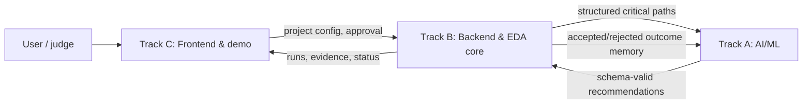
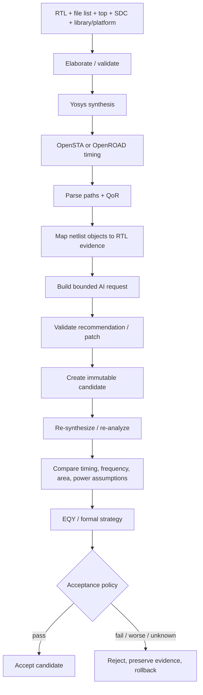
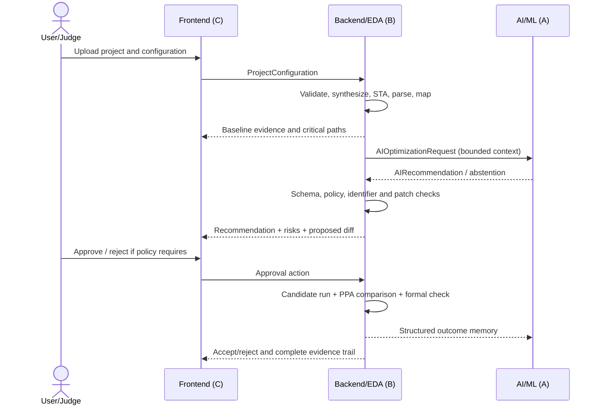

# Nebula@BITS Goa: practical project-development guide

Primary source: [official problem-statement PDF](D:/antigravity_projects/nebula/Nebula_Content.pdf), especially **PDF p. 2**. Schedule and participation details are on **PDF p. 1**. Research was checked on 4 August 2026.

## How to read this guide

Every project claim is tagged:

- **[PDF]** — explicitly stated in the official PDF. The page is cited; the PDF is not restated at length.
- **[Interpretation]** — a reasoned reading of what will be needed to make the PDF deliverable credible.
- **[Recommendation]** — an implementation or competition choice supported by research or engineering practice, but not required verbatim by the PDF.
- **[Team decision]** — deliberately left for the team to resolve. This guide gives criteria, not an answer.

Dates on PDF p. 1 are unusually tight: abstract submission is 6 August, final submission 15 September, and presentation 25 September. The year is not printed on the page, so do not add one to formal claims unless the organisers confirm it.

---

# 1. Interpretation of the challenge

## 1.1 What the organisers are genuinely asking you to demonstrate

**[PDF, p. 2]** The named deliverables form a closed engineering loop: timing analysis, GenAI-assisted RTL optimization, an optimized implementation, measured timing/frequency/PPA comparison, formal equivalence evidence, and an interactive workflow demo. The benchmark must also contain the specified multi-clock, generated-clock, CDC, divider, and approximate cell-scale characteristics.

**[Interpretation]** This is not primarily a “generate Verilog from English” challenge. It is a **constraint-grounded, evidence-producing optimization system**. The system must connect a probabilistic recommender to deterministic EDA measurement and correctness gates. A judge should be able to trace:

```text
constraint -> failing path -> mapped RTL context -> proposed transformation
          -> candidate RTL -> measured QoR -> equivalence result -> decision
```

The central engineering problem is therefore: **how can a GenAI component assist an RTL engineer in choosing and expressing changes that improve a specified timing objective, without letting the model invent success or silently change behavior?**

## 1.2 Superficial versus technically serious

| Level | What it looks like | Why judges may reject or value it |
|---|---|---|
| Superficial | Chat window accepts RTL, gives generic advice such as “add pipelining,” and shows manually entered before/after numbers | No causal link to a real critical path; no reproducible run; no correctness gate; AI is decorative |
| Still weak | Real synthesis report is pasted into an LLM, but reports are not parsed, suggestions are unconstrained, and only the best run is shown | Some tool grounding, but poor reproducibility and high cherry-picking risk |
| Technically serious | Versioned RTL and constraints; repeatable synthesis/STA; structured critical-path extraction; source mapping with confidence; constrained recommendations; candidate validation; identical rerun settings; explicit accept/reject policy; formal result and complete log | Demonstrates the whole PDF workflow and makes claims auditable |
| Research-grade stretch | Multiple candidates, calibrated ranking, memory of previous attempts, Pareto analysis, sequential-equivalence strategy, CDC-aware guardrails, ablations, and failure analysis | High research value, but only if the simpler loop is already reliable |

## 1.3 Proper division of authority

| Function | AI may do | Deterministic system must do |
|---|---|---|
| Understand results | Summarize a structured path, explain likely logic causes, rank hypotheses | Parse reports, identify actual endpoints/slack, preserve units and corners |
| Propose work | Select from allowed transformation families; provide rationale and predicted trade-off | Check the transformation is in policy, references real signals/lines, and is syntactically applicable |
| Modify RTL | Produce a minimal patch under a schema and change budget | Apply in an isolated candidate, compile/lint, rerun tools, keep the original immutable |
| Judge outcome | Explain measured differences after the fact | Decide pass/fail from EDA metrics, equivalence, constraints, and acceptance policy |
| Learn from attempts | Use prior structured outcomes to avoid repeats and adjust ranking | Deduplicate, detect cycles, store exact prompts/model/settings/tool artifacts |

**Hard rule:** the LLM never sets `optimization_succeeded=true`. That state is derived only after deterministic analysis and verification.

## 1.4 Claims that require measured evidence

Any claim containing “improves,” “meets,” “preserves,” “reduces,” “scales,” “faster,” “lower,” “equivalent,” or “handles” needs a recorded basis. In particular:

- Timing improvement needs identical clocks, SDC, Liberty library, synthesis and STA versions/options, analysis corner, and path type.
- Frequency improvement needs a declared derivation (for example, from a passing clock period or a clearly defined critical-delay calculation), not a model estimate.
- Area/cell improvement needs a consistent mapped library and hierarchy policy.
- Power improvement needs a stated activity assumption or trace and tool method; otherwise label it an estimate or omit it.
- Functional preservation needs a formal pass under documented assumptions. Simulation is supporting evidence, not formal equivalence.
- AI contribution needs an ablation against at least a manual/rule baseline and ideally a non-AI search or synthesis-only baseline.
- Scalability needs runs on more than one tiny example and at least one benchmark near the PDF’s target scale.

## 1.5 Difficult and ambiguous points

| Point | Status | Why it is difficult or ambiguous | Assumption to record before implementation |
|---|---|---|---|
| “Approximately 50K standard cells” | **[PDF, p. 2]** | Count changes with library, synthesis options, hierarchy, memories, and whether filler/physical-only cells count | Define target library, stage, cell types included, and acceptable band; seek organiser confirmation |
| Five independent master asynchronous clocks, plus generated clocks | **[PDF, p. 2]** | Requires a correct clock graph and consistent SDC; unrelated clocks should not be timed as synchronous | Define clock relationships, sources, ratios, phases, and which paths are asynchronous |
| CDC presence | **[PDF, p. 2]** | STA does not prove synchronizer/protocol correctness; careless optimization can destroy CDC safety | Define allowed CDC structures, protected modules, and CDC check evidence |
| “Pipelining” and “retiming” with formal equivalence | **[PDF, p. 2]** | A new pipeline stage changes latency; ordinary cycle-by-cycle equivalence may fail even if transaction behavior is intended to match | Define whether latency may change and what equivalence relation is required |
| “Performance” versus frequency | **[PDF, p. 2]** | Frequency, latency, and throughput can move in different directions | Define the primary metric and guardrails for the other two |
| Scope of the listed transformations | **[PDF, p. 2]** | Parentheses can be examples or an expected coverage list | Ask whether demonstrating one/few families deeply is acceptable |
| Timing stage | **[Interpretation]** | Synthesis-level STA is faster; post-placement/post-route is more physical but slower | Declare which stage is authoritative and which is a fast screening proxy |
| Formal tool meaning | **[Interpretation]** | SymbiYosys proves properties; EQY is specifically an equivalence driver | Define the “gold” and “gate” designs, reset assumptions, clocks, black boxes, and proof status semantics |

## 1.6 What judges are likely to probe

**[Interpretation]** Expect questions at the weakest link rather than the prettiest screen:

1. Is the reported path real, and can you show the raw evidence?
2. How is a gate-level path mapped to the RTL snippet, and can that mapping be wrong?
3. What exactly did GenAI contribute beyond built-in Yosys/OpenROAD optimization?
4. Are baseline and candidate runs truly comparable?
5. Does “formal pass” cover the whole design and the chosen transformation, or only a bounded/property subset?
6. How are asynchronous clocks and CDC paths constrained and verified?
7. Did pipelining improve frequency by silently increasing latency or changing protocol timing?
8. Are poor and failed candidates retained, or were results cherry-picked?
9. Does the benchmark genuinely meet the scale/clock conditions on PDF p. 2?
10. Can the demo recover from an LLM, parser, EDA, or proof failure?

---

# 2. Mandatory versus optional requirements

This classification is intentionally concise; consult PDF p. 2 for the exact official wording.

| Class | Scope | Basis |
|---|---|---|
| Core mandatory | Analyze RTL against timing constraints; identify critical paths/violations; GenAI-assisted recommendations; produce at least an optimized RTL outcome; evaluate timing/frequency/PPA; formal equivalence evidence; interactive workflow demo | **[PDF, p. 2]** objectives and deliverables |
| Benchmark mandatory | The clock-domain, generated-clock, CDC, divider-ratio, and approximate standard-cell-scale conditions | **[PDF, p. 2]** benchmark clause |
| Named implementation resources | Verilog/SystemVerilog, OpenSTA, Yosys, OpenROAD, SymbiYosys/EQY, Python, and an LLM/GenAI framework | **[PDF, p. 2]** “Tools & Resources”; treat “resources” as strong guidance unless organisers say every named tool is compulsory |
| Supporting functionality | Input validation, report parsing, source mapping, run IDs, versioning, structured schemas, logs, error states, rollback, and human approval | **[Interpretation]** needed to make official deliverables credible, but not individually named |
| Advanced functionality | Automatic patch application, multiple candidates, ranking, iteration memory, asynchronous jobs, Pareto exploration, sequential equivalence, CDC-aware structural guardrails | **[Recommendation]** valuable after the manual loop works |
| Optional enhancements | RAG over a curated transformation guide, local model, report export, live progress, path graphics, benchmark batch mode | **[Recommendation]** choose only if they strengthen evidence or demo clarity |
| Low-value spectacle | Generic chatbot, animated chip art, invented “AI confidence,” a multi-agent diagram with no measurable gain, 3-D layout visuals unrelated to the optimized path, or a long list of unsupported transformations | **[Recommendation]** visually impressive but weak against the judging questions above |

Minimum credible completion is not “all advanced features.” It is **one reliable, traceable, formally checked optimization loop on a tiny design, then the same framework demonstrated on a benchmark satisfying the official complexity conditions**.

---

# 3. Three-track team structure

The three members can each lead one track, but every artifact crosses track boundaries. The backend/EDA track owns ground truth; AI/ML proposes; frontend communicates and obtains approval.



## 3.1 Track A — AI/ML

| Item | Practical definition |
|---|---|
| Main responsibility | Convert a bounded, structured timing problem into explainable candidate transformations; never measure or certify success |
| Inputs | Critical-path record, small relevant RTL slice, source-map confidence, clock/constraint summary, allowed transformations, protected signals/modules, previous attempts, verification status |
| Outputs | One or more typed recommendations with target location, rationale, assumptions, expected trade-offs, risk flags, patch or patch plan, and abstention reason where appropriate |
| Required modules | Context builder; prompt/policy template; structured-output validator; candidate ranker; safety filter; retry/abstention logic; attempt-memory reader; model-call logger |
| API/data formats | Versioned JSON objects described in section 4; unified diff for patches; stable IDs for paths, files, candidates, and runs |
| Important decisions | Prompt-only vs tool-using; full RTL vs selected context; advisory vs patch-producing; single vs multiple candidates; transformation allowlist; model/provider/privacy; ranking objective |
| MVP | Given one parsed path and a curated RTL snippet, return one schema-valid recommendation or an explicit abstention; no auto-apply |
| Advanced | Candidate-generation/verification loop, retrieval of prior validated patterns, tool calls through backend only, calibrated ranking, outcome memory, multi-model or multi-agent debate |
| Main risks | Hallucinated signal names, unsafe sequential change, huge diffs, repeated suggestions, overconfident explanations, prompt injection in comments, leakage of proprietary RTL |
| Tests | Golden structured inputs; schema/property tests; nonexistent-signal tests; protected-CDC tests; invalid-JSON tests; repeatability at fixed settings; abstention tests; prompt-injection tests |
| Final deliverables | Model card/config; prompt and schema versions; recommendation logs; safety policy; ablation results; documented limitations |
| Dependencies | Needs Track B’s stable schema and real parser output; needs Track C’s approval/rejection semantics and explanation layout |

### Candidate AI approaches

| Approach | Complexity/data | Reliability/explainability | Cost/latency/reproducibility | Hallucination risk | Competition fit |
|---|---|---|---|---|---|
| Prompt-based LLM | Low; no training set | Moderate if context is small; rationale is inspectable but not proof | Low setup; API variability; fix model/settings and cache outputs | High without schema/guards | Strong starting baseline |
| Rule system + LLM | Moderate; curated rules, little labeled data | High for eligibility gates; good explanations | Low/moderate; deterministic pre/post-processing | Lower because rules bound action space | Often the best prototype trade-off |
| Tool-using agent | Moderate/high; backend tools must be safe | Better grounding, but more failure states | More calls and latency; replay needs full traces | Medium; tools correct facts but agent can misuse them | Good after a manual loop exists |
| RAG | Moderate; needs a clean, licensed corpus | Traceable recommendations if citations are returned | Retrieval adds latency; corpus/version can be pinned | Medium; retrieval does not guarantee correctness | Useful for transformation guidance and tool docs, not for success claims |
| Fine-tuned model | High; high-quality legal training/eval data | Can improve format/domain fluency; still needs tool verification | Training cost; serving may be stable/local | Still material | Usually unjustified within this schedule unless data/model already exist |
| Multi-agent system | High orchestration and token cost | Diverse critique is possible; accountability can blur | Highest latency/cost; nondeterministic interactions | Can amplify consensus hallucination | Stretch only if an ablation beats a simpler baseline |
| Structured-output generation | Low/moderate; schema design | Improves parseability, not semantic correctness | Small overhead; highly loggable | Reduces malformed output, not false content | Required pattern regardless of model |
| Candidate generation + verification | Moderate/high | Highest engineering reliability because tools arbitrate | EDA runtime dominates; reproducible with immutable runs | Contained by rejection gates | Best long-term architecture after MVP |

### What to send to the model

Send the minimum sufficient, normalized context:

- path ID, analysis stage/corner, setup/hold type, slack and units;
- startpoint, endpoint, clock domain, launch/capture relationship;
- ordered path elements summarized by instance/cell/function and incremental delay;
- logic depth/fanout where available;
- the smallest RTL span that plausibly owns those elements, plus module/interface context;
- relevant clock period, generated-clock relation, uncertainty and path exception summary;
- protected CDC/reset/interface/latency invariants;
- previous candidate summaries and deterministic outcomes;
- allowed transformation families and explicit non-goals;
- source-map confidence and unresolved mappings.

Do not send unbounded logs, unrelated repositories, secrets/API keys, proprietary Liberty/PDK contents, arbitrary user RTL comments as trusted instructions, or a “formal pass” claim without the backend’s exact status. Whole-project RTL is a **[Team decision]**, not a default.

### Output control and backend conversion

1. Require a versioned schema and enumerated transformation type.
2. Separate `observation`, `hypothesis`, `proposed_change`, and `expected_effect`; the model must not rewrite observations.
3. Require exact target file/module/lines or a patch precondition hash.
4. Limit changed files, lines, sequential elements, clocks, resets, interfaces, and CDC modules.
5. Reject unknown identifiers, out-of-scope paths, forbidden constructs, or malformed diffs before application.
6. Apply only in an isolated candidate version.
7. Compile/lint, synthesize, analyze, and verify through Track B.
8. Record the prompt hash, model/version, decoding settings, raw response, normalized output, validator result, and later EDA verdict.

## 3.2 Track B — Backend and EDA integration

| Item | Practical definition |
|---|---|
| Main responsibility | Own the authoritative design state and deterministic loop from ingestion through acceptance/rejection |
| Inputs | RTL/file list, top module, constraints, libraries/platform, run policy, AI recommendation or user patch, approval action |
| Outputs | Validated project, immutable run artifacts, parsed timing/PPA, source mappings, verification result, candidate verdict, progress/events |
| Required modules | Ingest validator; workspace/version manager; tool adapters; process runner; timing/PPA parsers; source mapper; AI request builder; patch validator/applier; comparison engine; equivalence adapter; iteration controller; artifact store |
| API/data formats | REST or local RPC for commands; server-sent events/WebSocket or polling for progress; JSON schemas; raw logs/reports; unified diffs; content hashes |
| Important decisions | Fast synthesis-only screen vs physical flow; toolchain/platform; sync vs async jobs; file store vs database; equivalence class; timeouts; objective/guardrails; CDC policy |
| MVP | One command/API creates a baseline run and one candidate run, parses WNS/area/cell count, runs EQY on an equivalence-preserving change, and emits a comparison record |
| Advanced | Containerized workers, job queue, post-placement/post-route metrics, parallel candidates, retries, caching, multi-corner analysis, CDC checks, Pareto archive |
| Main risks | Tool/version drift, SystemVerilog incompatibility, bad SDC, misleading source mapping, stale artifacts, proof timeouts, run explosion |
| Tests | Fixture RTL/SDC; parser golden files; tool smoke tests; timeout/crash tests; hash/version tests; idempotency; baseline/candidate configuration equality; rollback tests |
| Final deliverables | Reproducible toolchain, adapters, schemas, run manifest, raw/parsed artifacts, comparison and proof reports, failure logs |
| Dependencies | Provides ground truth to Tracks A/C; consumes Track A’s typed recommendation and Track C’s user configuration/approval |

### Deterministic pipeline and preserved information



Every stage preserves: project ID; candidate parent; run ID; input hashes; tool/container versions; full commands and environment allowlist; top/parameters/defines/includes; SDC and library hashes; stage/corner/units; raw stdout/stderr and report files; parsed schema version; timestamps/runtime/resources; status/exit code; and provenance links to upstream artifacts.

### Tool roles and integration dossier

| Tool | Exact role and invocation | Inputs -> outputs | Parsing/integration difficulty | Essential or replaceable; limitations and license |
|---|---|---|---|---|
| Yosys | Elaborate and synthesize RTL; invoke with a pinned `.ys`/Tcl-like script or ORFS stage | Verilog/SV subset, file list, top, defines, Liberty -> internal RTLIL, mapped netlist, stats, JSON | SystemVerilog support and hierarchy/memory mapping; synthesis can rename/flatten objects | **Named in PDF.** Replaceable by commercial synthesis, but keep Yosys for an open flow. `write_json` includes `src` attributes useful for mapping ([official docs](https://yosyshq.readthedocs.io/projects/yosys/en/v0.55/cmd/write_json.html)). ISC-style Yosys license; bundled components differ. |
| OpenSTA | Gate-level STA engine, normally driven by Tcl | Liberty, mapped netlist, SDC, optional SDF/SPEF -> checks, paths, slack | Reports are text-first; units/corners/path types must be captured; no CDC signoff | **Named in PDF.** Essential unless STA is supplied through OpenROAD/commercial tool. Supports generated/multiple-frequency clocks and standard timing inputs ([project docs](https://github.com/The-OpenROAD-Project/OpenSTA)); GPLv3 open source/dual commercial license. |
| OpenROAD | Physical implementation and physically informed timing/PPA; Tcl or Python interface | Netlist, LEF/Liberty/SDC/platform -> floorplan/placement/CTS/route databases and reports | Much longer runs; platform setup; post-route failures; higher infrastructure cost | **Named in PDF.** Replaceable for early screening, but valuable for credible physical metrics. BSD-3-Clause ([license](https://github.com/The-OpenROAD-Project/OpenROAD/blob/master/LICENSE)); individual dependencies/platforms have separate terms. |
| OpenROAD Flow Scripts (ORFS) | Reproducible wrapper from Yosys synthesis through OpenROAD and KLayout | RTL, SDC, library/LEF/platform config -> staged artifacts and metrics | Directory conventions, large images, version coupling; not itself a parser API | **Research recommendation.** Directly reusable architecture/tooling; BSD-3-Clause scripts, but audit each tool/platform/design license. Official flow lists RTL/SDC/.lib/.lef synthesis inputs and later signoff artifacts ([repository](https://github.com/the-openroad-project/openroad-flow-scripts)). |
| KLayout | Inspect/finish layout data and run technology-rule-dependent DRC/LVS steps in a full ORFS flow; GUI or batch scripts | DEF/GDS/OASIS, technology/rule files and netlists -> visual layout, finished GDS and check reports | Rule-deck/platform compatibility; physical-verification results do not explain an RTL timing change | **Optional for this challenge unless the team makes post-route/signoff claims.** It is replaceable by other layout/signoff tools and is not an RTL optimizer. GPL-2.0-or-later ([official license](https://www.klayout.de/license.html)); PDK/rule-deck terms remain separate. Learn evidence packaging and layout inspection, not RTL transformation logic. |
| EQY | Compare “gold” and “gate” designs with Yosys-based partitioned formal strategies | Two elaboration scripts, match/partition/strategy config -> PASS/FAIL, logs, failing traces | Matching internal state, memories, X semantics, resets, proof capacity | **Named in PDF.** Preferred open-source equivalence adapter; not a blanket solution for latency-changing transforms. Official quickstart shows gold/gate setup and failing VCD traces ([docs](https://yosyshq.readthedocs.io/projects/eqy/en/latest/quickstart.html)); ISC license. |
| SymbiYosys (SBY) | Orchestrate property proof, bounded model checking, cover, and engines | RTL + assertions/assumptions + `.sby` -> PASS/FAIL/UNKNOWN and traces | Correct properties/assumptions are hard; solver and SV support vary | **Named in PDF.** Complements rather than replaces EQY. SBY itself ISC; solver terms vary; open OSS CAD Suite and commercial Tabby options differ ([official docs](https://symbiyosys.readthedocs.io/en/latest/), [license notes](https://github.com/YosysHQ/sby)). |
| slang / yosys-slang | Robust SV syntax/elaboration/AST and optional Yosys frontend | SystemVerilog file list -> diagnostics, AST JSON or Yosys design | Synthesis semantics must still match downstream; plugin/version coupling | **Optional recommendation.** Useful direct component for source analysis; slang MIT and exposes Python bindings/AST JSON ([repository](https://github.com/MikePopoloski/slang)); do not assume every elaborated construct synthesizes. |
| Verilator or Icarus Verilog | Fast lint/compile/simulation smoke gate before expensive synthesis | RTL + testbench -> diagnostics, executable simulation, traces | Simulator/synthesis semantic differences and incomplete language corners | **Optional recommendation.** Replaceable. Verilator is LGPL-3.0 or Artistic-2.0 and notes limitations such as SDF/mixed-signal ([repository](https://github.com/verilator/verilator)); Icarus is GPL. Simulation supports but does not replace formal evidence. |
| Python | Orchestration, adapters, parsers, schemas, comparison, job control | All project metadata/artifacts -> API objects, state machine, reports | Unsafe shell construction, path isolation, long-process management | **Named in PDF.** Essential only as chosen orchestration language; Python’s own license is permissive, while every package needs a lockfile/license inventory. |

### Backend design choices

| Choice | Option A | Option B | Decision criterion |
|---|---|---|---|
| Execution | Synchronous subprocess for tiny MVP | Asynchronous worker/job queue | Switch when a run outlives an HTTP request or multiple candidates run concurrently |
| Tool isolation | Host install | Pinned container image | Containers improve reproducibility; confirm memory, platform files, and license-server rules |
| Storage | Run directories + manifests/JSON | Database metadata + object/file artifacts | File-based is fastest and Git-friendly; DB helps concurrent status/querying. Never put huge raw reports only in DB |
| Versioning | Git commit/branch per candidate | Content-addressed snapshots + parent hashes | Git gives reviewable diffs; snapshots handle generated/untracked inputs. A hybrid is practical |
| API updates | Polling | Server-sent events/WebSocket | Polling is simplest and demo-safe; streaming is useful for live logs but adds failure modes |
| Evaluation | Fast synth+STA for every candidate | Two-tier screen then physical confirmation | Use physical confirmation when claims would otherwise depend on wire delay or placement |
| Failure policy | Stop entire experiment | Mark candidate failed and continue within budget | Continue only for isolated candidate failures; stop for invalid baseline/configuration |

### Required failure behavior

| Failure | Deterministic response | UI/AI consequence |
|---|---|---|
| Invalid RTL | Reject at syntax/elaboration; store diagnostics; do not synthesize | Show exact stage/error; AI may receive sanitized diagnostics for one repair attempt if allowed |
| Failed synthesis | Candidate status `SYNTHESIS_FAILED`; preserve netlist absence and log | Cannot be compared or accepted; never call it “worse PPA” |
| Missing/invalid constraints | Baseline is invalid; stop optimization | Ask for correction; do not estimate success from unconstrained timing |
| Empty timing report | Distinguish “no paths,” “all unconstrained,” parser mismatch, and tool failure | Block AI call until classified |
| Worse timing | Record regression with exact delta; reject under timing-first policy unless Pareto policy allows | Feed structured outcome to memory, not raw full logs |
| Area regression | Apply declared tolerance/Pareto rule | Highlight trade-off rather than hiding it |
| Equivalence FAIL | Reject and preserve counterexample | Show failure positively as a safety gate working; optionally permit repair |
| Equivalence UNKNOWN/timeout | Never convert to PASS | Candidate remains unaccepted or “needs review” |
| Tool crash/timeout | Kill process tree, retain partial logs, retry only if policy says transient | Show retry count; no duplicate candidate creation |
| Unparseable LLM output | Schema rejection; one bounded repair/retry | No patch application |
| Repeated/cyclic suggestion | Hash normalized transformation/patch and compare to ancestry | Penalize/ban repeat; stop at iteration budget |

## 3.3 Track C — Frontend and demonstration

| Item | Practical definition |
|---|---|
| Main responsibility | Make causality, evidence, uncertainty, status, and human control understandable within minutes |
| Inputs | Project/run/candidate objects, progress events, parsed paths, source maps, recommendation, diff, metrics, proof status, raw-artifact links |
| Outputs | Valid configuration and uploads, explicit approvals/rejections, selected path/candidate, filters, downloadable evidence report |
| Required modules/views | Project setup; files/constraints; baseline progress; violation/path explorer; RTL highlight; recommendation; diff/approval; QoR comparison; proof; history; advanced logs; report export |
| API/data formats | Same versioned contracts as Tracks A/B; never scrape terminal text in the browser |
| Important decisions | Stack; live vs precomputed state; path visualization depth; raw evidence access; approval points; offline mode |
| MVP | A stable, read-only dashboard for one prepared baseline/candidate plus one real approval action that triggers backend evaluation |
| Advanced | Live progress, multiple candidates/Pareto plot, cross-linked path graph and source, replay of history, downloadable run bundle |
| Main risks | UI implying false certainty, status race conditions, unreadable raw logs, demo depending on long live runs, styling consuming core time |
| Tests | Contract fixtures; empty/error/timeout states; status transitions; large log virtualization; browser refresh/reconnect; offline/precomputed mode; demo rehearsal |
| Final deliverables | Interactive demo, judge-friendly flow, evidence/export views, demo dataset, fallback recording/screenshots and operator script |
| Dependencies | Requires Track B’s stable state machine/data and Track A’s concise rationale/risk fields |

### Information hierarchy

- **Always visible:** project/top, active clock/corner, baseline validity, selected path/slack, candidate status, metric deltas with units, equivalence verdict, and whether data are live or cached.
- **Graphical:** clock-domain overview; ordered critical path; before/after metric bars or slope chart; candidate timeline; pass/fail gates.
- **Raw evidence on demand:** exact tool version/command, SDC excerpt, original report slice, complete logs, proof trace/status, input hashes.
- **Advanced panel:** fanout/cell arc detail, parser warnings, model parameters/token usage, container digest, solver strategy.
- **Updated live:** stage status, timestamps, streamed tail, cancellation and retry state. Do not animate values that are not yet measured.
- **Precomputed for the final demo:** at least one full baseline, one accepted candidate, one rejected candidate, and all heavy physical/proof artifacts.

### Frontend stack comparison

| Option | Time | Flexibility/visual quality | Backend integration | Demo reliability | Status, limitations, license |
|---|---|---|---|---|---|
| React SPA | Medium | Highest control; good for custom path/diff views | Clean REST/events separation | High once built; separate dev/build services | Open source, MIT ([React repository](https://github.com/facebook/react)); more UI plumbing and deployment work |
| Next.js | Medium | React quality plus routing/server features | Can proxy APIs or remain separate | High, but server/client boundaries add concepts | Open-source React framework; docs describe full-stack features ([official docs](https://nextjs.org/docs)); MIT. Avoid unnecessary SaaS/auth complexity |
| Streamlit | Fast | Good data views; limited fine-grained interaction/layout | Very easy with Python backend objects | High for prepared flows; rerun model can complicate long jobs | Open source Apache-2.0 ([repository](https://github.com/streamlit/streamlit)); fastest dashboard MVP |
| Gradio | Fastest for model demos | Excellent input/output panels; weaker systems dashboard/history UX | Direct Python functions/APIs | Good for narrow demos | Open source Apache-2.0 ([repository](https://github.com/gradio-app/gradio)); can make the project look like an LLM toy rather than an EDA system |
| Lightweight Python dashboard | Fast/medium | Depends on chosen framework | Simple local integration | Good if dependencies are few | “Lightweight” is an architecture, not a product; license follows selected packages. Custom widgets become maintenance |
| Desktop application | Slow | Strong offline packaging and local-file access | Direct local service/process | Potentially high after packaging | Packaging, OS permissions, and updates are extra scope; use only if offline/local execution is a core demo constraint |
| CLI + web dashboard | Medium | CLI gives robust recovery; web gives presentation | Strong separation and scriptability | Highest operational resilience | Two interfaces to maintain, but CLI can reproduce evidence when UI fails |

**[Team decision]** Select on team capability and demo risk, not perceived prestige. Freeze the data contracts first so the UI can be changed without rewriting the EDA core.

---

# 4. Interfaces between AI/ML, backend, and frontend

## 4.1 Contract principles

1. Every object has `schema_version`, stable ID, creation time, and provenance.
2. Quantities are `{value, unit}`; never rely on implied ns, MHz, µm², or mW.
3. Raw artifacts remain immutable and are referenced by hash/path; parsed fields are a derived view.
4. Status distinguishes `PASS`, `FAIL`, `ERROR`, `TIMEOUT`, `UNKNOWN`, and `NOT_RUN`.
5. AI observations quote structured backend facts by ID; model predictions live in different fields.
6. Candidate ancestry is explicit, so rollback and cycle detection are possible.
7. Schema changes are versioned and contract fixtures are shared by all tracks.

## 4.2 Conceptual schemas

These are field contracts, not complete implementation models.

### `ProjectConfiguration`

```text
project_id, schema_version, display_name
source_bundle_hash, file_list[{path, hash, language, role}]
top_module, include_dirs[], defines{}, parameters{}
constraint_files[{path, hash}], clock_expectations[]
library_id, liberty_hash, platform_id, analysis_corners[]
toolchain_lock{container_digest, tool_versions}
objective{primary_metric, direction, guardrails{}, tie_breakers[]}
run_policy{timeouts{}, max_iterations, max_candidates, approval_mode}
security{model_data_policy, protected_paths[], redact_patterns[]}
```

Why: two runs are comparable only if the elaboration, timing environment, objective, and toolchain are explicit.

### `TimingAnalysisResult`

```text
analysis_id, run_id, stage, corner, check_type, status
units{time, capacitance, resistance}
clocks[], generated_clocks[], asynchronous_groups[]
wns, tns, violation_count, unconstrained_endpoint_count
critical_path_ids[], report_artifact, parser_version, parser_warnings[]
```

Why: headline slack without stage/corner/path coverage can be misleading.

### `CriticalPathRecord`

```text
path_id, analysis_id, rank, check_type, slack, arrival, required
startpoint{object, type, clock}, endpoint{object, type, clock}
launch_clock, capture_clock, relationship, exception_summary
elements[{order, pin, instance, cell_type, function, incr_delay, cumulative_delay}]
logic_depth, fanout_summary
source_links[{file, line_start, line_end, netlist_object, confidence, method}]
mapping_status, raw_report_span
```

Why: the AI and UI need ordered evidence and uncertainty, not a prose paste.

### `AIOptimizationRequest`

```text
request_id, project_id, parent_candidate_id, path_ids[]
facts{timing_summary, constraint_summary, source_map_summary}
rtl_context[{file, hash, lines, text, role}]
invariants{interfaces, latency, reset, clock, protocol, cdc}
allowed_transformations[], forbidden_changes[], change_budget
previous_attempts[{recommendation_id, patch_hash, verdict, measured_delta, failure_class}]
required_output_schema, model_data_classification
```

Why: it bounds authority and makes previous failure learning explicit.

### `AIRecommendation`

```text
recommendation_id, request_id, model_record_id
transformation_type, target{module, file, lines, identifiers[]}
observation_refs[], hypothesis, rationale
preconditions[], predicted_effects[{metric, direction, confidence_band, basis}]
risks[], invariants_claimed[], validation_plan[]
action{kind: advise|patch|abstain, patch_id?}
uncertainty, abstention_reason, schema_validation
```

Why: prediction and evidence are separate; abstention is a valid safe result.

### `RTLPatch`

```text
patch_id, recommendation_id, base_source_hash
format, diff_text, changed_files[], changed_line_count
precondition_hashes{}, touched_identifiers[]
declared_semantic_class, latency_delta, interface_delta
clock_reset_cdc_touch_flags{}, apply_status, static_validation_results[]
```

Why: a patch must be replayable against exactly the source it was meant for.

### `VerificationResult`

```text
verification_id, candidate_id, method, tool, version, status
equivalence_relation{cycle_exact|sequential|property_set, latency_mapping?}
gold_hash, gate_hash, top, clocks_resets, assumptions[], blackboxes[]
proof_scope, engine_strategy, runtime, peak_memory
proved_partitions, failed_partitions, unknown_partitions
counterexample_artifacts[], log_artifact, limitations[]
```

Why: the word “formal” is meaningless without relation, assumptions, scope, and UNKNOWN handling.

### `PPAComparison`

```text
comparison_id, baseline_run_id, candidate_run_id
configuration_equivalence{same_toolchain, same_constraints, same_library, same_corner}
metrics[{name, baseline, candidate, absolute_delta, relative_delta, unit, source_artifact}]
latency_throughput_changes, guardrail_results[]
pareto_status, acceptance_policy_version, verdict, verdict_reasons[]
```

Why: prevents comparing runs with different measurement conditions.

### `OptimizationIterationHistory`

```text
experiment_id, project_id, baseline_candidate_id
iterations[{index, parent_candidate_id, recommendation_id, patch_id,
            stage_statuses{}, comparison_id?, verification_id?, verdict,
            failure_class?, started_at, ended_at}]
budget{max_iterations, max_runtime, max_model_cost, consumed}
cycle_detection{seen_patch_hashes[], seen_action_signatures[]}
accepted_candidate_ids[], pareto_candidate_ids[], stop_reason
```

Why: complete history supports reproducibility, learning, and honest failure analysis.

---

# 5. End-to-end application workflow



| Stage | Owner | Input -> output | Possible failure | Recovery |
|---|---|---|---|---|
| 1. Upload/configure | C, supported by B | Files and choices -> `ProjectConfiguration` | Missing top/file, unsafe archive, unsupported language | Validate paths/types/size; return actionable field errors |
| 2. Validate | B | Configuration -> elaborated design manifest | Syntax, duplicate module, missing include, wrong parameters | Preserve diagnostics; permit corrected config without new project ID |
| 3. Baseline synthesis/STA | B | Valid manifest -> baseline artifacts | Tool crash, missing Liberty, invalid SDC, unconstrained paths | Stop optimization; classify configuration vs tool failure; allow pinned retry |
| 4. Parse/map | B | Reports/netlist metadata -> timing/path/source objects | Format drift, ambiguous mapping, empty report | Parser-version fixture; mark confidence; expose raw span; never invent mapping |
| 5. Build AI context | B with A contract | Selected paths/context policy -> request | Oversized/sensitive/contradictory context | Truncate by semantic priority, redact, or abstain before model call |
| 6. Recommend | A | Structured request -> recommendation(s) | Hallucination, malformed schema, no safe option | Schema retry once; validate facts; allow explicit abstention |
| 7. Validate recommendation | B | Recommendation -> eligible/rejected action | Unknown signal, protected CDC, forbidden latency/interface change | Reject with reason; no source mutation |
| 8. Generate/approve candidate | B/C | Eligible patch/plan + approval -> candidate snapshot | Patch conflict, stale base, human rejection | Rebase only through a new request; preserve decision |
| 9. Re-run EDA | B | Candidate + frozen settings -> measured artifacts | Compile/synthesis/STA failure, timeout | Candidate fails; original untouched; optional bounded repair |
| 10. Compare | B | Baseline/candidate results -> `PPAComparison` | Settings differ or metric missing | Declare non-comparable; rerun with locked settings |
| 11. Formal check | B | Gold/gate + proof config -> `VerificationResult` | FAIL, UNKNOWN, timeout, invalid assumptions | Reject or manual review; use counterexample for diagnosis; never relabel UNKNOWN |
| 12. Accept/reject | B policy, optional C approval | Comparison + formal result -> verdict | Conflicting metrics or policy ambiguity | Pareto/manual-review status; do not silently choose weights |
| 13. Display/export | C | Linked objects/artifacts -> evidence trail/report | Stale UI, lost connection, huge logs | Reload from persisted state; show cached/precomputed artifacts with labels |

---

# 6. Implementation-first and parallel execution plan

## 6.1 What to build first

The highest-risk unknown is not the LLM. It is whether the team can produce a **repeatable baseline path, make one deliberately small RTL change, measure it under unchanged settings, and prove the intended equivalence**. Build that vertical slice before agent frameworks, elaborate UI, a 50K-cell benchmark, or model training.

### Thirteen implementation stages

| Stage | Objective; build | Owner/support | Input -> output | Completion criterion | Main risk; fallback | Not yet |
|---|---|---|---|---|---|---|
| 1. Freeze requirements | Create a one-page requirement/assumption register tied to PDF pages; list organiser questions | All; B records | PDF + questions -> signed scope v1 | Every PDF item has a test/evidence owner; ambiguities listed, not silently answered | No organiser reply; use documented conservative assumptions | Architecture polish, model choice |
| 2. Tiny manual EDA flow | Run one small single-clock RTL through syntax, Yosys and STA by hand; archive commands/artifacts | B; A/C observe | Tiny RTL + SDC + Liberty -> netlist/report/stats | Another teammate reproduces the same parsed headline values | Tool setup/SV issue; use simple Verilog and known ORFS smoke design | Multi-clock, queues, frontend |
| 3. Parse timing reports | Turn one known report into typed timing/path records with raw-span links | B; A/C define consumers | Golden reports -> JSON fixtures | Parser extracts units, WNS/TNS/count and top paths; failure cases tested | Report format drift; pin tool version and support one format first | General parser for every vendor |
| 4. Manual RTL optimization | Engineer one small equivalence-preserving change and predict its effect before rerun | B lead, A documents reasoning | Baseline path + RTL -> candidate + comparison | Same flow reruns; result can improve, regress, or tie, but is honestly captured | Synthesis erases difference; choose a micro-design with a visible logic pattern | Letting LLM edit automatically |
| 5. Formal equivalence | Prove the manual candidate under explicit reset/input assumptions | B; A uses result schema | Gold/gate RTL -> PASS/FAIL/UNKNOWN artifact | A known-good change passes and an injected bug fails with trace | Solver/parser/capacity; reduce module or use property harness while labeling scope | Latency-changing pipeline proof |
| 6. Backend orchestration | Wrap stages 2–5 in an immutable run state machine | B; A/C consume fixtures | Project config -> baseline/candidate run bundle | One command/API repeats flow; IDs, hashes, logs, timeouts, rollback work | Process management; keep single-worker synchronous CLI first | Distributed workers/microservices |
| 7. Basic frontend | Present persisted vertical-slice evidence; add approval action | C; B API, A wording | Contract fixtures/live API -> workflow dashboard | Refresh-safe display of baseline, path, diff, metrics, proof and raw links | Backend instability; use shared recorded JSON fixtures | Fancy graph/layout editor |
| 8. AI recommendations | Replace the manual suggestion step with structured recommend/abstain output | A; B validates, C presents | Path + RTL context -> typed recommendation | Fixed evaluation set meets schema and identifier-validity targets; no success claims | Model variability; rule+prompt baseline and cached outputs | Fine-tuning/multi-agent |
| 9. Candidate evaluation automation | Apply approved bounded patches, evaluate and gate automatically | B; A supplies candidate, C approval/history | Valid recommendation -> accepted/rejected iteration | At least one pass, one regression and one formal fail take correct branches | Unsafe patch; advisory-only fallback | Unbounded autonomous loop |
| 10. Multi-clock/CDC complexity | Add clock graph, generated clocks, async groups, protected CDC policy and tests | B; A guards, C overview | Valid small multi-clock design -> classified paths/CDC evidence | All clocks found; synchronous timing and CDC evidence are separately represented; unsafe edits blocked | Open-source CDC gap; structural rule checks + assertions + explicit limitation, or licensed academic tool if available | Full 50K scale and AI changes inside CDC |
| 11. Scale benchmark | Integrate/construct the official-scale benchmark with provenance and cell-count definition | B; all validate | Candidate benchmark + constraints -> reproducible baseline | Documented synthesis count near agreed range; five independent asynchronous master-clock domains, at least one recorded generated clock per master, divider-ratio and CDC inventory; stable run | Large design/tool incompatibility; staged subsystem composition or validated synthetic harness | Broad benchmark sweep |
| 12. Controlled experiments | Freeze protocol, run baseline/ablations/candidates, retain all attempts | All; B owns run ledger | Frozen versions + experiment matrix -> tables/artifacts | Runs are reproducible; no missing failures; confidence/variance policy documented | Compute/time; reduce matrix before changing protocol | Marketing claims or cherry-picking |
| 13. Report and demo | Convert evidence into submission, rehearsal, and fallback assets | C coordinates; A/B own claims | Complete run bundles -> report/demo/slides | Independent rehearsal answers judge questions and survives model/network failure | Slow/fragile live flow; precompute heavy stages and keep one short live gate | Last-minute feature additions |

## 6.2 Proof-of-concept gates

Do not advance on calendar alone. Use these gates:

```text
Gate 0: PDF traceability and assumptions frozen
  -> Gate 1: manual baseline is reproducible
  -> Gate 2: parser agrees with raw report
  -> Gate 3: one candidate is compared fairly
  -> Gate 4: known-good PASS and injected-bug FAIL in formal flow
  -> Gate 5: API/UI replay the evidence
  -> Gate 6: AI output is bounded and rejectable
  -> Gate 7: multi-clock official-scale benchmark qualifies
  -> Gate 8: controlled experiment and demo freeze
```

## 6.3 Parallel team execution

| Workstream | Can start immediately | Needs an upstream artifact | Temporary mock |
|---|---|---|---|
| AI/ML | Literature/product review; schema draft; transformation allowlist; prompt tests on a hand-written path; safety/abstention tests | Real parser output and source-map confidence before claiming integration | Versioned `CriticalPathRecord` and small RTL snippet fixture |
| Backend/EDA | Toolchain smoke test; small RTL/SDC; parser; manifests; EQY; error taxonomy | AI schema for request adapter; UI contract for status/events | Hand-written recommendation and diff |
| Frontend/demo | User journey; wireframes; status/error components; metrics/diff/proof views; demo script outline | Stable API objects and state transition names before live wiring | One JSON bundle each for running, accepted, rejected, failed, timeout |

### What cannot safely start early

- AI ranking cannot be evaluated until Track B supplies measured candidate outcomes.
- Source highlighting cannot claim precision until the mapper exposes confidence and raw provenance.
- Automatic application cannot start until patch policy, immutable candidate creation, and rollback exist.
- Pipelining/retiming support cannot be called correct until the equivalence relation and latency policy are frozen.
- The final multi-clock demo cannot be trusted until clock classification and CDC evidence are separated from STA.
- Report result sections cannot be written until the experiment protocol is frozen and actual runs exist.

### Weekly integration checkpoint

Every week, the team should produce **one replayable end-to-end bundle**, not three slide updates:

1. a tagged schema version and contract fixtures;
2. a baseline or candidate run manifest with hashes and raw artifacts;
3. one frontend walkthrough using those exact objects;
4. one AI recommendation/abstention linked to a real path;
5. an integration failure added to the regression suite;
6. an updated PDF traceability matrix and risk register;
7. a 3–5 minute demo rehearsal recording after the vertical slice exists.

Use a twice-weekly 30-minute integration session initially: first to agree contracts, second to replay the current vertical slice. This prevents a “final week merge.”

### Example schedule aligned to the PDF dates

| Window | Integrated outcome |
|---|---|
| Before abstract | Scope, architecture options, evaluation intent, no fabricated results; one-page technical direction |
| Week 1 | Manual single-clock baseline, parser fixture, UI mock, AI schema baseline |
| Week 2 | Manual candidate + EQY pass/fail + backend run bundle |
| Week 3 | Basic dashboard + structured recommendation + rejection guards |
| Week 4 | Automated single-candidate loop; accepted and rejected history |
| Week 5 | Multi-clock/CDC benchmark integration and source-map hardening |
| Final build window | Controlled runs, ablations, report evidence, frozen demo and fallbacks |

This is a planning recommendation, not an organiser schedule beyond the dates on PDF p. 1.

---

# 7. Existing research, products, companies, startups, and reusable work

## 7.1 How to read claims in this landscape

- **Peer-reviewed** means the paper appeared at a named venue; it does not mean every result was independently reproduced.
- **Author-reported** means the source is a paper or vendor/customer case study from parties invested in the result.
- **Independent verification not found** means this review did not find a public third-party reproduction of the exact claim; it does not prove the claim is false.
- A public GitHub repository is not automatically reusable. If no license is present, copying is legally unsafe without permission.

## 7.2 Research and open-source comparison

| Organization/project | What it does; relation | Reuse category/status | Evidence and similarity/difference | Limitations, license, realistic lesson |
|---|---|---|---|---|
| CUHK et al., **RTLRewriter** (ICCAD 2024) | Partitions RTL, retrieves optimization guidance, uses multimodal program cues and cost-aware search, then verifies rewrites; closest published match to RTL PPA rewriting | Architecture idea + benchmark; peer-reviewed research | Paper reports gains over Yosys/e-graph on small/large suites ([paper](https://www.cse.cuhk.edu.hk/~byu/papers/C239-ICCAD2024-RTL-rewrite.pdf)); directly similar in rewriting/PPA, but the Nebula brief emphasizes timing paths, multi-clock/CDC, and formal deliverable | Public [benchmark repo](https://github.com/yaoxufeng/RTLRewriter-Bench) contains 55 short and five long cases, but no license file was visible; treat as view-only until permission. Claims are author-reported, not an independently reproduced product result. Learn partitioning, retrieval, and search patterns; do not copy code/data without a license |
| NYU et al., **AutoChip** | Iteratively feeds compiler/simulation errors back to an LLM to repair HDL | Architecture pattern + evaluation scripts/dataset | Open paper reports tool feedback improved some models and that benefits were model-dependent ([2024 study](https://arxiv.org/abs/2411.11856)); similar feedback loop, but feedback is compile/simulation rather than timing/PPA/formal equivalence | Small generation benchmarks do not establish multi-clock timing closure. Public repository was announced, but a clear root license was not found in this review; verify before reuse. Learn bounded tool-feedback loops and cost accounting |
| **SymRTLO** (2025 preprint) | Combines LLM rewriting, RAG rules/AST templates, symbolic FSM optimization, and formal/test validation | Research architecture idea; not a direct dependency | Reports large best-case PPA improvements on RTL-Rewriter using commercial and open synthesis ([preprint](https://arxiv.org/abs/2504.10369)); very similar optimization/verification structure | Preprint and author-reported; “up to” values are not typical results and commercial-tool correlation may not transfer. Learn neuro-symbolic guardrails and fast verification staging, not headline numbers |
| **Dr. RTL** (2026 preprint) | Agentic timing optimization using tool-grounded self-improvement and commercial synthesis feedback | Research architecture/benchmark idea | Targets realistic timing optimization and equivalence ([preprint](https://arxiv.org/abs/2604.14989)); closest recent conceptual comparator | Too new for mature independent replication; commercial workflow and compute are hard to reproduce in a student project. Learn structured memory and deterministic evaluation; do not claim parity |
| NVIDIA, **ChipNeMo** | Domain-adapts an LLM with continued pretraining, instruction tuning and retrieval for assistant, EDA-script and bug-summary tasks | Research-only model methodology; proprietary data/model assets | NVIDIA reports domain adaptation can let smaller models match/lower general models on selected internal tasks ([official research page](https://research.nvidia.com/publication/2023-10_chipnemo-domain-adapted-llms-chip-design)); relevant to report interpretation/RAG, not direct RTL timing optimization | Evaluation relies heavily on proprietary NVIDIA data and internal use cases; exact results are not independently reproducible. Learn that domain retrieval may beat rushing into fine-tuning |
| **ChatEDA** | LLM agent decomposes natural-language EDA tasks, writes scripts, and invokes RTL-to-GDS tools | Agent/tool orchestration pattern; research | Preprint describes planner/executor integration ([paper](https://arxiv.org/abs/2308.10204)); similar in tool use, different because Nebula needs source-level optimization evidence | Reported comparisons are author-run; public production code/reproducibility is limited. Learn strict tool adapters and task decomposition, not unconstrained shell generation |
| NVIDIA, **VerilogEval** | Evaluates LLM Verilog completion/spec-to-RTL using compile/simulation harnesses | Direct reusable evaluation harness and small benchmark; open source | ICCAD 2023 plus 2024 revision; useful for AI syntax/function baselines, not timing closure ([research page](https://research.nvidia.com/index.php/publication/2023-09_verilogeval-evaluating-large-language-models-verilog-code-generation), [repo](https://github.com/NVlabs/verilog-eval)) | Problems are much smaller than the official benchmark and do not cover five-clock CDC. MIT license; version the benchmark because v1/v2 tasks differ. Claims can be reproduced with the harness but model/provider results vary |
| **VeriGen** | Fine-tunes a CodeGen-family model on Verilog corpora for specification-to-RTL generation | Research precedent for the fine-tuning option; not a direct optimizer component | The paper reports improved generation results over selected general models ([preprint](https://arxiv.org/abs/2308.00708)); it supports testing fine-tuning only when a licensed, task-matched corpus exists | It addresses module generation rather than timing-path-guided edits, and its results are author-reported. Training-corpus provenance and model-weight terms must be audited before reuse. Learn the data/cost/reproducibility burden of fine-tuning; do not infer that fine-tuning is necessary here |
| HKUST, **RTLLM / RTLLM-2.0** | 29 then 50 design tasks with testbenches/reference RTL and post-synthesis quality evaluation including WNS | Direct reusable benchmark/evaluation pattern; open source | ASP-DAC 2024 and ICCAD 2024 work; relevant for syntax/function/PPA methodology ([repo](https://github.com/hkust-zhiyao/RTLLM)) | Generation benchmark, not existing-RTL critical-path optimization; designs do not by themselves meet Nebula’s official clock/scale clause. MIT license. Learn progressive syntax/function/design-quality gates |
| **EDALearn** | Open RTL-to-signoff datasets/benchmark for ML-for-EDA across stages and technologies | Benchmark/data architecture idea; research | Offers reproducible cross-stage data framing ([paper](https://arxiv.org/abs/2312.01674)); useful for experiment schema and feature design | Not an LLM RTL rewriter and may not match the required clock topology/size. Verify repository/component licenses before importing. Learn consistent stage features and provenance |
| OpenROAD, **AutoTuner/METRICS2.1** | Searches EDA flow hyperparameters with Ray and scores PPA from standardized metrics | Direct reusable open flow component / architecture pattern | OpenROAD describes JSON parameter spaces and PPA reward functions ([project milestone](https://theopenroadproject.org/openroad-key-milestones-on-the-road-towards-good-ppa/)); a strong non-LLM baseline | Optimizes tool recipes, not RTL source; distributed search can consume large compute. Claims are project-reported, with some industry case-study use. Learn objective functions, trial logging and fair comparison |
| Google Research, **AlphaChip/Circuit Training** | RL macro floorplanning, not RTL rewriting | Open research framework; analogy only | Nature 2021 paper and public code ([paper](https://www.nature.com/articles/s41586-021-03544-w), [repo](https://github.com/google-research/circuit_training)) show a tool-grounded search pattern | Different design stage and high training cost; reproduction/performance claims have been contested ([TILOS benchmark effort](https://github.com/TILOS-AI-Institute/MacroPlacement), [critical re-evaluation](https://arxiv.org/abs/2306.09633)). Repo notes Linux/research status and hMETIS licensing nuance. Learn to use strong public baselines and avoid “AI beats humans” claims |

## 7.3 Commercial products and startups

| Organization/product | What it does; project relation | Status/reuse | Evidence and verification | Limitations and realistic lesson |
|---|---|---|---|---|
| Synopsys **DSO.ai** | RL-driven search over design-flow options for PPA; relates to the outer optimization loop, not necessarily RTL patch generation | Commercial; idea/benchmark comparator, no reusable component | Official product says it explores large flow spaces with Fusion Compiler/ICC2 ([product page](https://www.synopsys.com/ai/ai-powered-eda/dso-ai.html)); Synopsys reports production tapeouts and customer case studies, but public independent raw runs are unavailable | Requires expensive licensed stack/compute and proprietary designs. Learn objective/guardrail search, warm-start memory, and run-budget accounting |
| Cadence **Cerebrus Intelligent Chip Explorer** | ML/RL full-flow optimization and distributed design exploration | Commercial; architecture/UX comparator | Cadence product page includes customer-reported PPA cases such as Renesas ([official page](https://www.cadence.com/en_US/home/tools/digital-design-and-signoff/soc-implementation-and-floorplanning/cerebrus-intelligent-chip-explorer.html)) | Vendor/customer evidence, not public benchmark reproduction; integrates proprietary Cadence flow. Learn multi-objective cockpit, run management, and keeping engineers in control |
| Siemens **Aprisa AI** | AI features within RTL-to-GDS digital implementation; flow exploration and generative assistance | Commercial | Siemens reports productivity/compute/PPA benefits ([official page](https://www.siemens.com/en-gb/products/ic/ic-design/aprisa/ai/)) | Marketing metrics are not independently reproducible; does not imply source RTL rewriting. Learn that “AI-assisted timing closure” may optimize recipes/implementation rather than edit RTL |
| Cadence **Jasper SEC** / Synopsys **VC Formal or Formality** | Commercial equivalence platforms; sequential equivalence is relevant when retiming, pipelining or state mapping breaks a simple cycle-by-cycle comparison | Commercial verification tools; direct tool only if a suitable academic license and supported flow are available | Vendor documentation distinguishes logical from sequential equivalence and describes state-mapping/proof workflows ([Cadence Jasper SEC](https://login.cadence.com/content/cadence-www/global/en_US/home/tools/system-design-and-verification/formal-and-static-verification/jasper-verification-platform/jaspergold-sequential-equivalence-checking-app.html), [Synopsys equivalence overview](https://www.synopsys.com/glossary/what-is-equivalence-checking.html), [VC Formal](https://www.synopsys.com/verification/static-and-formal-verification/vc-formal.html)) | Closed, expensive and capacity-dependent; vendor capability descriptions are not proof that a particular candidate passes. Learn to declare the equivalence relation and latency/reset assumptions before choosing a transformation; use EQY/SBY where they can substantiate the narrower claim |
| Synopsys **VC SpyGlass CDC** / Siemens **Questa CDC** | Structural/formal CDC analysis, synchronizer recognition, protocol/reconvergence checks | Commercial verification tools; possible academic-license direct tool, otherwise methodology reference | Vendors explicitly state STA/simulation alone do not solve CDC; Questa describes structural recognition and assertion generation ([SpyGlass](https://www.synopsys.com/verification/static-and-formal-verification/spyglass/spyglass-fpga.html), [Questa CDC](https://www.siemens.com/en-gb/products/ic/questa-one/design-solutions/clock-domain-crossing/)) | License/access may block use. Vendor claims are not a substitute for your run. Learn to separate CDC signoff evidence from timing reports and to protect synchronizer structures |
| Rapid Silicon **RapidGPT** | Conversational/code-completion assistant for FPGA HDL workflows | Commercial product; interface idea | Company announcement confirms HDL interaction/code completion ([official announcement](https://rapidsilicon.com/rapid-silicon-announces-rapidgpts-official-availability/)) | Public evidence for timing/PPA optimization and formal equivalence is limited; FPGA/vendor workflow differs. Learn that a chat UI alone is insufficient for this challenge |
| **ChipAgents** | Commercial agentic environment for RTL design, verification and debug | Commercial startup; product/architecture comparator | Company describes RTL generation/debug/verification workflows ([site](https://chipagents.ai/)); some conference/demo material exists, but most scale/performance claims are company-reported | Closed system, internal benchmarks, and no reusable core. Learn role separation, on-prem/privacy positioning, and the need to expose deterministic proof evidence |
| **Silimate** | Chip-design copilot aimed at design understanding and PPA feedback | Commercial startup; UX/product comparator | Company describes adapting feedback to a customer’s technology and helping understand design trade-offs ([site](https://www.silimate.com/)) | Public technical details and independent benchmarks are sparse. Learn the value of technology-specific context and a design-state cockpit; do not infer unsupported RTL-edit capabilities |

## 7.4 Benchmark candidates and licensing reality

| Source | Relevance | Reuse/limits |
|---|---|---|
| **OpenTitan** | Large, production-oriented SystemVerilog project with real multi-clock/CDC methodology and reusable crossing primitives | Apache-2.0 for the main repository ([repo](https://github.com/lowrisc/opentitan)); complex generated RTL, dependencies and tool flows make whole-SoC integration risky. Its own methodology stresses proven CDC submodules and production CDC tools ([docs](https://opentitan.org/earlgrey_1.0.0/book/doc/contributing/hw/methodology.html)). Use as a reference or selected, license-audited modules—not an automatic drop-in |
| **PULPissimo** | Real open MCU SoC with multiple subsystems/clocks and divider logic | Public repository with Solderpad-style project licensing and many dependencies; its README notes primary simulation flows expect commercial Questa/Xcelium and open simulation needs work ([repo](https://github.com/pulp-platform/pulpissimo)). Strong realism, high integration risk |
| ORFS bundled designs | Already flow-qualified under specific platforms; useful to calibrate cell counts and tool setup | ORFS explicitly warns that each design/platform/tool has its own license ([repo](https://github.com/the-openroad-project/openroad-flow-scripts)). Most individual examples will not satisfy the official clock topology without a wrapper or composition |
| RTLLM/VerilogEval/RTLRewriter benchmark | Convenient small AI regression and transformation-pattern sources | Valuable secondary tests, not sufficient proof of the PDF benchmark clause; see license notes above |

**[Recommendation]** Use a two-tier benchmark strategy: a tiny “truth fixture” for rapid regression plus one separately qualified official-scale benchmark. Whether the large benchmark is adapted open RTL, a composed subsystem, or purpose-built is a **[Team decision]**. Publish a license/provenance manifest and a clock/cell qualification report.

## 7.5 Patents as boundary/context, not implementation recipes

- [US11714950B2, “Automated timing closure on circuit designs”](https://patents.google.com/patent/US11714950B2/en) describes ML selecting strategies in an EDA-flow exploration stage. It is conceptually relevant to candidate ranking and closed-loop timing closure, but a patent is not open-source permission and its claims require legal interpretation before commercial implementation.
- [US20260023539A1, agentic LLM RTL generation with progressive feedback](https://patents.justia.com/patent/20260023539) describes an LLM generator/executor feedback loop using testbench/EDA errors. It is a useful signal that this architecture is commercially active, not proof that the approach is novel or safe.
- The AlphaChip Nature page identifies related US patent 10,699,043 for neural floorplanning. It concerns physical placement, not this source-RTL task.

For a student competition prototype, cite patents only as prior-art context. Do not make freedom-to-operate claims.

## 7.6 Realistic gap your prototype could investigate

Do not claim novelty yet. A defensible **gap statement to test** is:

> Existing public LLM RTL work is dominated by small specification-to-RTL or generic PPA rewriting benchmarks, while commercial AI tools mostly expose closed flow optimization. There is room to evaluate a transparent, human-reviewable loop that links parsed timing paths to bounded RTL context, records every candidate, and uses open deterministic timing/equivalence evidence under a deliberately multi-clock benchmark.

This becomes a contribution only if the literature review remains current and your experiments show the integration works. Multi-clock/CDC safety, source-map uncertainty, and rejected-attempt evidence may be more credible differentiators than a new model.

---

# 8. Alternative architecture options

## Option 1 — Human-in-the-loop recommendation system

```text
EDA baseline -> structured path -> AI explanation/recommendation
            -> engineer writes/approves change -> deterministic rerun/proof
```

| Dimension | Assessment |
|---|---|
| AI role | Interpret and recommend; optional patch preview |
| Deterministic role | All extraction, measurement, application, comparison and proof |
| Human involvement | Select path, approve/edit recommendation, decide trade-offs |
| Complexity/reliability | Lowest / highest |
| Demo value | Strong if evidence is cross-linked; less “autonomous” spectacle |
| Research value | Good for explainability, mapping and trust studies |
| Failure modes | Generic advice, slow manual edit, subjective acceptance |
| Timeline suitability | Highest; best fallback architecture even if automation slips |

## Option 2 — Semi-automated candidate-generation and verification loop

```text
EDA baseline -> AI emits bounded candidate(s) -> backend validates
            -> optional human approval -> parallel/serial evaluation
            -> proof + policy gate -> human accepts/Pareto-selects
```

| Dimension | Assessment |
|---|---|
| AI role | Generate one/few typed patches and predicted trade-offs |
| Deterministic role | Eligibility, patch application, EDA, formal, dedupe and verdict |
| Human involvement | Approval at patch and/or final acceptance |
| Complexity/reliability | Medium / good if guards are strict |
| Demo value | Very high: shows useful automation and rejected candidates |
| Research value | Strong for ranking, feedback, acceptance rate and ablation |
| Failure modes | Patch conflicts, run cost, proof UNKNOWN, repeated variants |
| Timeline suitability | Good after Option 1 vertical slice is complete |

## Option 3 — Autonomous iterative optimization agent

```text
objective -> agent selects path/action -> generates candidate -> tools evaluate
         -> memory/reward update -> repeat until budget/goal -> final proof/review
```

| Dimension | Assessment |
|---|---|
| AI role | Plan, select transformations, generate and adapt from outcomes |
| Deterministic role | Sandboxed execution, measurements, proof, budgets, hard safety gates |
| Human involvement | Initial policy and final signoff; emergency stop |
| Complexity/reliability | Highest / lowest without substantial engineering |
| Demo value | High when it works; catastrophic when live iteration stalls |
| Research value | Highest potential, but demands baselines and many runs |
| Failure modes | Cycles, reward hacking, cost explosion, local optima, unsafe edits, nondeterminism |
| Timeline suitability | Stretch; must degrade cleanly to Option 2/1 |

## Decision framework — do not choose by label

Score each architecture 1–5 with evidence:

| Criterion | Evidence required before scoring |
|---|---|
| Official coverage | Trace each PDF p. 2 objective/deliverable to a working artifact |
| Correctness confidence | Known-good/known-bad formal tests and latency/CDC policy |
| End-to-end reliability | Ten consecutive replayed runs or a documented smaller target |
| Median demo time | Rehearsal measurement, including cold start |
| Engineering effort remaining | Backlog with owner/dependency, not intuition |
| AI value | Ablation versus rules/manual/synthesis-only |
| Reproducibility | Pinned tool/model settings and complete run bundle |
| Failure recovery | Demonstrated timeout, model outage and formal-fail behavior |
| Research value | Testable question and sufficient experiment budget |
| Judge clarity | Independent viewer can explain input, action, evidence and verdict |

Apply a hard gate: any architecture that cannot reliably produce PDF-mandated evidence is ineligible regardless of autonomy or visual appeal.

---

# 9. Abstract-writing framework

Do not spend the abstract restating PDF p. 2. Its job is to define **your chosen gap, system boundary, verification plan and evaluation**, while distinguishing proposed work from completed work.

| Section | Purpose | Include / exclude | Length | Questions and evidence discipline |
|---|---|---|---|---|
| 1. Brief context | Place the work in timing closure | Include one precise motivation; exclude the full challenge wording and broad semiconductor history | 1 sentence | Why does RTL-level feedback matter? Cite literature if making scale/productivity claims |
| 2. Specific gap | State what existing workflows/public work do not adequately expose | Include a narrow gap your review supports; exclude “no one has ever…” | 1 sentence | Is it report grounding, closed-loop evidence, multi-clock handling, source mapping, or verification? Needs literature/product review |
| 3. Proposed direction | Name the framework and its boundary | Include recommend/apply mode and pipeline; exclude an exhaustive feature list | 1–2 sentences | What enters, what leaves, who remains in control? |
| 4. AI + deterministic interaction | Assign authority | Include structured context, constrained candidate output, and EDA arbitration; exclude “AI optimizes timing” as an unsupported black box | 1–2 sentences | What is probabilistic and what is measured? |
| 5. Verification strategy | Establish safety | Include equivalence relation, tool class, and failure handling; exclude “functionally correct” without scope | 1 sentence | Cycle-exact or sequential? What about latency/CDC? |
| 6. Evaluation plan | Make claims falsifiable | Include benchmarks, baselines, frozen settings, metrics, ablations; exclude invented outcomes | 1–2 sentences | How will better/worse be determined and cherry-picking avoided? |
| 7. Expected contribution | State what artifact/knowledge may result | Include a framework, dataset/schema, or empirical finding as future work; exclude “state of the art” | 1 sentence | What will be reusable or learned even if AI gains are small? |
| 8. Practical importance | Close with user value | Include auditability or iteration reduction; exclude fabricated productivity percentages | 1 sentence | Why would an RTL engineer/judge care? |

### Placeholder sentence structures only

- `[Existing challenge] makes [specific engineering activity] iterative because [bounded cause].`
- `Existing [research/tool category] leaves [specific gap] insufficiently addressed under [benchmark/verification condition].`
- `We propose to investigate [proposed framework], which connects [EDA analysis method] to [AI responsibility] through [structured interface].`
- `The model will be limited to [allowed action], while [deterministic tool] will determine [measurement/verdict].`
- `Candidate changes will be checked using [verification mechanism] under [assumptions/equivalence relation].`
- `Evaluation will compare [baseline families] on [benchmark classes] using [evaluation metrics] with [controls].`
- `The expected contribution is [artifact/empirical question], rather than an unverified claim of [weak claim].`
- `If validated, the approach could [practical importance] while retaining [human/tool control].`

### Future tense without false results

Use: “we propose,” “we will evaluate,” “the framework is intended to,” “we hypothesize,” and “expected contribution.” Use present tense only for completed facts you can demonstrate now. Never write “achieves,” “improves,” “ensures,” or a percentage until the corresponding run bundle exists.

### Suitable terms/keywords

From the PDF and literature: `timing closure`, `RTL optimization`, `static timing analysis`, `critical-path analysis`, `timing constraints`, `generative AI`, `tool-grounded feedback`, `formal equivalence checking`, `power–performance–area (PPA)`, `human-in-the-loop`, `clock-domain crossing`, `generated clocks`, `reproducible EDA`, `structured output`, `candidate verification`.

Avoid `autonomous signoff`, `guaranteed optimization`, `tapeout-ready`, `novel`, `industry-grade`, or `state of the art` unless the work and evidence truly support them.

---

# 10. Final-submission framework

## 10.1 Source repository

```text
README / quick evidence map
docs/
  requirements-and-assumptions
  architecture-and-contracts
  benchmark-qualification
  toolchain-and-licenses
configs/
  projects / clocks / constraints / objectives
schemas/
backend/
ai/
frontend/
tests/
  fixtures / parser / contracts / safety / integration
experiments/
  protocol / manifests / summaries
examples/
  tiny_truth_fixture / demo_project
artifacts/ or documented external artifact bundle
LICENSE, NOTICE, third-party manifest, CITATION, limitations
```

Do not commit proprietary PDK/library/model material or API keys. If large raw artifacts are external, provide hashes, retrieval instructions, and a small public example.

## 10.2 Technical report structure and ownership

| Section | Evidence | Owner | Likely judge question; avoid |
|---|---|---|---|
| 1. Scope and traceability | PDF page mapping; confirmed assumptions | All/B | “Which official item does this satisfy?” Avoid adding requirements as if official |
| 2. Problem framing/prior work | Literature/product comparison with evidence status | A | “What is actually different?” Avoid unsupported novelty |
| 3. System boundary/architecture | Component and trust-boundary diagrams; interface versions | B with A/C | “Who decides success?” Avoid making the LLM authoritative |
| 4. Benchmark | Provenance/license; clock graph; CDC inventory; cell-count method | B | “Does it really meet PDF p. 2?” Avoid vague “about 50K” |
| 5. EDA methodology | Exact flow, stages, library/corner/SDC, tool locks | B | “Are numbers comparable/physical?” Avoid mixing stages/corners |
| 6. Source mapping | Method, confidence, validation sample, failure cases | B/A | “Can a gate path be traced to this line?” Avoid exact-looking low-confidence maps |
| 7. AI method | Context policy, schemas, prompts/model config, safety/abstention | A | “Why this model/approach?” Avoid claiming reasoning as proof |
| 8. Candidate and verification policy | Patch limits; eligibility; equivalence relation; proof assumptions | B/A | “What happens to pipelining/CDC?” Avoid PASS without scope |
| 9. Experiments | Frozen protocol, baselines, ablations, all attempts | All/B | “Did you cherry-pick?” Avoid excluding failures |
| 10. Results | Tables/plots linked to run IDs and raw artifacts | B/C | “Are deltas meaningful?” Avoid invented or incomparable numbers |
| 11. Failure analysis | Invalid/worse/non-equivalent/timeout cases | A/B | “What did not work?” Avoid hiding rejected attempts |
| 12. User workflow/demo | Screens and task walkthrough; time measurements | C | “Is UI connected to real tools?” Avoid hard-coded output |
| 13. Limitations/threats to validity | Tool correlation, benchmark representativeness, model variance, CDC gaps | All | “Would this generalize/sign off?” Avoid production claims |
| 14. Reproducibility/licensing | Setup, hashes, seed/settings, license manifest | B | “Can we rerun it legally?” Avoid undocumented dependencies |
| 15. Conclusions/future work | Claims bounded to results | All | Avoid converting plans into achievements |

## 10.3 Other submission artifacts

- **Architecture documentation:** trust boundaries, state machine, contracts, artifact lineage, failure/recovery paths.
- **Installation guide:** supported OS/container, resource requirements, exact smoke test, expected output, offline mode.
- **Toolchain documentation:** versions/commits, images, libraries/PDKs and licenses, solver choices, model/provider settings.
- **Experiment configuration:** frozen project manifest, objective/guardrails, clocks/SDC/corner, timeouts/budgets, seeds.
- **Baseline/optimized results:** machine-readable comparison plus human-readable table; every row links to a run ID.
- **Formal evidence:** gold/gate hashes, relation, assumptions, scope, solver/strategy, PASS/FAIL/UNKNOWN and traces.
- **AI logs:** model metadata, prompt/schema versions, raw and normalized output, validator decision, token/cost if allowed, later measured verdict.
- **Failed-attempt analysis:** failure taxonomy, representative traces, whether a retry/repair was allowed, lesson.
- **Demo:** live script, precomputed bundle, offline model response, operator checklist, fallback video.
- **Presentation:** one narrative from failing path to evidence, not a duplicate of the report.

## 10.4 Reproducibility checklist

- [ ] PDF version/hash and requirement-assumption matrix included.
- [ ] Benchmark source, modifications, license and cell-count definition included.
- [ ] RTL/file list/top/parameters/defines/includes hashed.
- [ ] SDC, Liberty/LEF/PDK/corner and activity assumptions hashed and legally redistributable or documented.
- [ ] Tool/container/solver/model versions or immutable identifiers pinned.
- [ ] Commands, environment allowlist, seeds/decoding parameters and timeouts recorded.
- [ ] Baseline and candidate use identical settings unless a difference is the stated experimental variable.
- [ ] Raw reports/logs and parsed-schema versions retained.
- [ ] Formal relation, assumptions, black boxes, scope and UNKNOWN handling documented.
- [ ] Every attempted candidate, not only winners, appears in the history.
- [ ] Report tables are generated from run manifests or independently cross-checked.
- [ ] A clean machine can execute the tiny truth fixture and reproduce its statuses.
- [ ] Third-party licenses and model/API usage restrictions are inventoried.
- [ ] Secret/proprietary files are excluded and redaction rules tested.

---

# 11. Demo strategy

## 11.1 Demonstrate causality, not screens

A compact story:

```text
1. Show original RTL/clock intent and baseline run identity.
2. Open one real violating path and its raw report line.
3. Follow mapped evidence to RTL; show mapping confidence.
4. Show one bounded AI recommendation and its declared risks.
5. Approve/apply a minimal diff.
6. Run or replay deterministic synthesis/STA and formal gates.
7. Compare metrics under identical settings.
8. Show acceptance or rejection plus complete history.
```

### Live versus precomputed

| Run live | Precompute, but make auditable |
|---|---|
| Project/config validation; opening raw artifacts; selecting path; schema validation; patch approval/application; a fast syntax or small synthesis/formal smoke gate | Large benchmark synthesis, physical OpenROAD stages, long equivalence partitions, multi-candidate exploration, power analysis |

For every precomputed result, show run ID, timestamp, input hashes, tool versions, command/config, raw artifact, and a “cached/precomputed” label. A judge can then verify authenticity without waiting.

## 11.2 Failure handling during the demo

- **Slow EDA:** display persisted stage progress and switch to the already completed run with the same input hash; explain why physical evidence is precomputed.
- **Internet/model failure:** use a locally cached, cryptographically linked model response from the same request object, or fall back to a deterministic rule recommendation. Clearly label replay mode.
- **Formal failure:** show the failed partition/counterexample, candidate rejection and preserved original. This proves the safety gate.
- **Formal timeout/UNKNOWN:** say “not proven,” do not present it as a failure or success; use a precomputed candidate whose proof completed for the main story.
- **Rejected optimization:** compare its predicted effect with measured regression, show the reject rule, and explain how history prevents repetition. This is evidence of engineering maturity.
- **Frontend failure:** reproduce the same bundle through a simple CLI/report page.

## 11.3 Avoid looking hard-coded

1. Change a harmless configuration field or choose a second path and show IDs update.
2. Open the exact raw report and run manifest behind a card.
3. Apply a patch and show the content hash/parent change.
4. Include both accepted and rejected candidates.
5. Run a tiny validation live from a clean state.
6. Keep visible labels for live, cached and manually curated data.

## 11.4 Time-bounded demo outline

For an unknown presentation limit, build a 6-minute core that can shrink to 3 or expand to 10:

- 0:00–0:30 — objective and trust boundary.
- 0:30–1:15 — benchmark/clock/constraint overview and baseline validity.
- 1:15–2:15 — one critical path, raw evidence and RTL mapping.
- 2:15–3:15 — AI recommendation, risks, diff and approval.
- 3:15–4:30 — deterministic evaluation and formal verdict.
- 4:30–5:15 — before/after plus rejected candidate/history.
- 5:15–6:00 — experiment evidence, limitations and contribution.

## 11.5 Slide-by-slide presentation structure

Do not write final slides until results freeze.

| Slide | Job | Evidence/visual |
|---|---|---|
| 1. Claim boundary | One sentence on what the prototype assists and what it does not automate | AI/deterministic/human trust split |
| 2. Official target | Point to PDF p. 2 and the traceability matrix | Minimal official requirements map |
| 3. Why the gap matters | Show one real report-to-RTL pain point | Small path/report example, cited prior work |
| 4. Architecture options and chosen scope | Explain team’s later decision and why | Architecture diagram + decision criteria |
| 5. Benchmark/clock intent | Prove qualification | Clock tree, async groups, CDC types, cell-count definition |
| 6. End-to-end flow | Prepare demo | State/gate diagram |
| 7. Live path-to-recommendation | Show AI value | Raw report, structured path, source highlight, recommendation |
| 8. Candidate safety | Show bounded change and deterministic gates | Diff, validator checklist, proof scope |
| 9. Results | Present actual measurements only | Baseline/candidate table/Pareto view with run IDs |
| 10. Ablations/failures | Separate AI effect and show honesty | Manual/rule/AI comparison; invalid/rejected rates |
| 11. Reproducibility | Establish credibility | Tool locks, manifests, artifact bundle |
| 12. Limitations and next decisions | Bound claims | CDC/equivalence/mapping/model limitations |
| 13. Contribution | State what was demonstrated | Framework/evidence/empirical finding, not hype |

---

# 12. Experimental-evaluation framework

## 12.1 Freeze the experiment before seeing results

Define in advance:

- benchmark versions and inclusion/exclusion criteria;
- baseline RTL and synthesis/physical flow;
- tool versions, platform/library, corner, SDC and activity source;
- objective function and guardrails;
- allowed transformation families and iteration/run budget;
- model/settings and number of independent samples;
- equivalence relation and acceptance rule;
- treatment of error/timeout/UNKNOWN;
- full attempt retention and report-generation method.

## 12.2 Metric definitions and traps

| Metric | Use | Critical control/interpretation |
|---|---|---|
| Worst negative slack (WNS) | Worst setup/hold deficit | Report setup and hold separately, with stage/corner/clock; positive slack is not “negative” |
| Total negative slack (TNS) | Aggregate failing slack | Confirm tool definition and endpoint set; not comparable if constraints/path groups change |
| Critical-path delay | Longest relevant data path | State whether computed from arrival, path delay, or clock period/slack |
| Maximum frequency | Intuitive speed metric | State derivation; generated/multiple clocks need per-domain values; do not collapse blindly to one number |
| Violation count | Breadth of closure issue | Keep setup/hold and path groups separate |
| Cell count | Complexity/area proxy | Define mapped cell inclusion; sequential/combinational/buffer categories matter |
| Area | Mapped or physical footprint | Use same library/stage; physical core/die area differs from summed cell area |
| Power | Dynamic/leakage estimate | Needs corner, voltage, temperature, clock gating and activity method; absent trace means low-confidence estimate |
| Latency | Cycles/time from transaction input to output | Pipelining can increase cycles while increasing frequency |
| Throughput | Accepted/results per cycle or second | Define protocol and steady state; do not infer from frequency alone |
| Runtime | Wall and optionally CPU time | Record hardware, worker count, cache state; separate model and EDA time |
| Iterations | Search effort | Count invalid/rejected attempts, not only successful synthesis runs |
| Recommendation acceptance rate | Human/policy usability | Report human-approved, tool-eligible and final-accepted as different rates |
| Invalid recommendation rate | AI safety/reliability | Predefine invalid classes: schema, identifier, syntax, policy, compile |
| Formal-equivalence success rate | Correct candidate fraction | Separate FAIL, UNKNOWN, timeout and not-run; state proof scope |
| Human intervention | Automation burden | Count approval/edit/recovery events and approximate active time with a defined protocol |

## 12.3 Baselines and ablations

At minimum consider:

1. **Original RTL under the frozen flow** — the only valid baseline for before/after claims.
2. **Synthesis-only/tool-recipe baseline** — same RTL, built-in optimization or fixed synthesis strategies; isolates gains the tool already provides.
3. **Rule-only recommender** — same allowlist and backend without an LLM; isolates language-model value.
4. **Prompt-only LLM** — no attempt memory/RAG/tool feedback; measures the value of added architecture.
5. **Human-authored candidate** where feasible — sanity reference, not necessarily a contest.
6. **Random or enumerated allowed transformations** on a tiny benchmark, if search space permits — tests whether ranking adds value.

Do not claim “AI caused the PPA gain” merely because the LLM wrote the patch; synthesis performs substantial deterministic optimization. Attribute contribution through controlled ablation.

## 12.4 Fair candidate comparison

1. Start candidates from an immutable baseline or explicitly named parent.
2. Keep toolchain, constraints, library/platform, corner, hierarchy, seeds and analysis stage fixed.
3. Verify input/config hashes before computing deltas.
4. Use the same timeout and resource allocation.
5. Count all attempts and predeclare the candidate budget.
6. Run stochastic model conditions enough times to report distribution, or fix deterministic decoding and state that scope.
7. For physical flows with seed/noise, repeat enough runs or use a paired protocol.
8. Report accepted, rejected, invalid, failed and timed-out candidates.
9. Avoid choosing clocks or benchmarks after seeing which make the method look best.

## 12.5 What counts as genuinely better

This is a **[Team decision]** encoded as an acceptance policy. Common choices:

- **Timing-first with guardrails:** required timing improvement or closure; area/power/latency may regress only within declared limits; formal must PASS.
- **Feasibility-first:** first candidate meeting all constraints wins; secondary metrics rank feasible candidates.
- **Weighted score:** compact but sensitive to arbitrary weights and normalization; publish weights before experiments.
- **Pareto policy:** retain non-dominated candidates across timing/area/power/latency/throughput; human chooses. Honest but more complex to explain.

No candidate is “better” if settings are non-comparable, formal is FAIL/UNKNOWN under a required PASS policy, a protected CDC rule is violated, or a hidden latency/protocol change invalidates the metric comparison.

## 12.6 Honest reporting

- Show absolute values, deltas and units, not percentages alone.
- Report median/distribution where repeated runs exist; do not use only the best sample.
- Separate synthesis-level from post-placement/post-route evidence.
- Show a complete per-attempt appendix or downloadable log.
- Explain trade-offs and negative results.
- List threats to validity: benchmark representativeness, tool correlation, model drift, parser confidence, proof scope, and open-source/commercial flow differences.

---

# 13. Risk register

Likelihood and impact are initial qualitative estimates; update weekly from observed failures.

| Risk | Likelihood | Impact | Detection | Mitigation | Fallback | Owner |
|---|---|---|---|---|---|---|
| Invalid RTL generation | High | High | Schema/static checks, lint/elaboration | Patch limits, templates, identifier validation, small diffs | Advisory-only recommendation | A/B |
| Hallucinated timing explanation | High | High | Every fact references parsed field/raw span | Separate observation/hypothesis; fact validator; abstention | Show deterministic summary only | A |
| Wrong timing-to-RTL mapping | High | High | Sampled manual trace, confidence score, unresolved status | Preserve Yosys `src`, hierarchy aliases and raw path; multi-signal triangulation | Module-level rather than line-level highlight | B/A |
| Synthesis failure | Medium | High | Exit/status and missing artifacts | Compile gate; pinned tool/parser; isolated candidate | Reject candidate, retain baseline | B |
| Formal equivalence failure | High for aggressive edits | Critical | EQY FAIL/counterexample | Transformation allowlist, explicit invariants, proof-friendly partitions | Reject; show safety gate; manual repair | B/A |
| Formal UNKNOWN/timeout | Medium/high at scale | High | Explicit status/runtime/partition counts | Proof decomposition, match hints, bounded resource policy | Narrow proof scope with honest label or do not accept | B |
| Latency-changing transformation | Medium | Critical | Interface/latency metadata, cycle tests, sequential proof | Freeze latency policy; block pipeline edits until relation exists | Support only cycle-exact transforms | All/B |
| Multi-clock constraint error | High | Critical | `check_timing`, unconstrained endpoints, clock inventory | Machine-readable clock graph; reviewed SDC; golden clock tests | Demo single-clock loop plus prequalified multi-clock analysis, clearly scoped | B |
| CDC safety regression | Medium | Critical | Structural CDC rules, assertions, commercial CDC if available | Protect synchronizers; typed CDC inventory; forbid AI edits by default | No CDC optimization; analyze only and disclose tooling gap | B/A |
| Tool incompatibility/SV support | High | High | Early elaborate/smoke matrix | Use supported SV subset or slang frontend; pin versions | Simplified benchmark/wrapper; commercial academic license if permitted | B |
| Benchmark misses ~50K/clock clause | Medium | Critical | Qualification report after synthesis | Define count; size early; inspect clock/divider/CDC inventory | Compose/parameterize benchmark; ask organiser for tolerance | B/All |
| Large runtime/compute exhaustion | High | High | Per-stage runtime/resource metrics | Two-tier screening, caching, budgets, precompute | Fewer candidates; synthesis-level main loop + physical confirmation subset | B |
| Model cost/token overrun | Medium | Medium | Per-call token/cost ledger | Small context, one retry, candidate budget, cache | Local/smaller model or rule baseline | A |
| Internet/model outage | Medium | High for demo | Health check and timeout | Cached response, offline request bundle, provider abstraction | Rule/manual recommendation path | A/C |
| Licensing/IP restriction | Medium | Critical | Dependency/data/model license inventory | Use permissive sources; do not distribute PDK/proprietary RTL; honor API policies | Replace asset/tool or provide setup-only instructions | All/B |
| Reproducibility drift | High | High | Hash/version mismatch and rerun test | Containers/lockfiles/manifests; immutable artifacts | Publish tiny reproducible fixture and limitations | B |
| Demo instability | Medium | High | Rehearsal failure log | Precompute heavy stages, offline mode, CLI fallback, freeze early | Recorded backup with live artifact inspection | C/B |
| Insufficient novelty evidence | Medium | Medium/high | Updated comparison matrix; ablation result | Phrase as evaluated gap; emphasize integration/evidence if model novelty is absent | Present rigorous engineering contribution and negative findings | A/All |

---

# 14. Team decision checklist

Do not let the LLM or this guide answer these implicitly. Record each decision, evidence, participants, date and revisit trigger.

| Decision | Why it matters | Available choices and trade-offs | Evidence needed | Tracks |
|---|---|---|---|---|
| Recommend only or auto-apply? | Changes safety, demo automation and backend scope | Advisory is safest/fastest; approval-gated balances value; autonomous maximizes research risk/value | Vertical-slice reliability, invalid-patch rate, rollback proof | A/B/C |
| First transformation families? | Determines schema, proof difficulty and data | Combinational restructuring/FSM encoding are more cycle-exact; retiming/clock gating/pipelining may need stronger equivalence and latency policy | Manual examples, synthesis visibility, proof tests | A/B |
| Full RTL or selected context? | Affects model quality, privacy, cost and hallucination | Whole project gives context but overload/leakage; slices are safer but may omit dependencies; hierarchical retrieval is middle ground | Context ablation, token budget, mapping coverage, data policy | A/B |
| How map paths to RTL? | Core credibility link | Yosys `src`; name/hierarchy map; AST/net graph; debug database; heuristic hybrid | Manual mapping precision/coverage sample and failure taxonomy | B/A/C |
| Unsafe-recommendation rejection? | Defines trust boundary | Static policy only; lint/elaboration; formal-before-PPA; full staged gate | Known-bad mutation suite and false accept/reject rates | A/B |
| Successful optimization definition? | Prevents after-the-fact cherry-picking | Timing-first; constraint feasibility; weighted score; Pareto | Stakeholder priorities, baseline distributions, metric availability | All |
| Timing/area/power/latency/throughput priority? | Transformations trade these off | Lexicographic, guardrails, weighted, Pareto | Application intent and measurable metrics | All |
| Authoritative timing stage? | Determines credibility/runtime | Post-synthesis STA; placed; routed/signoff-like; two-tier | Correlation study on sample candidates and demo budget | B/A |
| Multi-clock representation? | Drives SDC, UI and AI context | Clock graph with relations; flat list; per-domain objects | Generated-clock tests, clock inventory review | B/C/A |
| CDC path handling? | STA cannot certify CDC | Exclude async timing and protect known crossings; structural checks; licensed CDC; formal protocol properties | CDC inventory, tool access, negative tests | B/A |
| Which changes need sequential equivalence? | Cycle-exact proof may reject valid retiming/pipelining | Forbid latency changes; fixed latency mapping; general SEC/commercial tool | Known transform proof experiments and interface contract | B/A |
| Reset/X/black-box semantics? | Formal results depend on them | Strict initialized model; explicit assumptions; abstraction | Reset spec, solver behavior, counterexample review | B |
| Iteration/candidate budget? | Controls cost, cycles and reproducibility | Fixed count, time, token/EDA budget, convergence criterion | Median runtimes/cost and diminishing-return pilot | A/B |
| Human approval points? | Shapes safety and UX | Before patch, before expensive run, before acceptance, or policy-dependent | User-flow rehearsal and failure consequences | All/C |
| AI ranking method? | Determines search efficiency | Heuristic rules, LLM score, measured history model, Pareto acquisition | Candidate outcome dataset and ablation | A/B |
| Benchmark source? | Determines official compliance and reproducibility | Adapt open SoC, compose licensed blocks, purpose-built benchmark | Cell count, clock/CDC qualification, license/tool compatibility | All/B |
| “Approximately 50K” definition/tolerance? | Official acceptance ambiguity | Mapped logic cells band; post-place standard cells; exclude/include physical cells | Organiser clarification and synthesis report | All/B |
| Live demo steps? | Balances authenticity and time | Small flow live; large cached; hybrid | Rehearsal times and failure rates | C/B/A |
| Minimum viable project? | Protects official deliverables | One path/one transformation/one accepted + rejected candidate/full evidence is a candidate definition, not an automatic answer | PDF traceability and gate completion | All |
| Stretch goal? | Prevents uncontrolled scope | Multi-candidate, autonomous loop, RAG, post-route, sequential equivalence, CDC integration | Remaining time after MVP, measured bottleneck | All |
| Model/provider/deployment? | Cost, privacy, latency and repeatability | Hosted frontier; local open weights; hybrid | Evaluation set, license/usage terms, data policy, offline demo | A/B |
| What is the claimed contribution? | Controls abstract/report honesty | Integration framework; mapping; safety gates; empirical study; benchmark/schema | Literature review and actual results | All/A |

---

# 15. Recommended immediate next actions

These actions reduce risk without deciding the open architecture questions for you.

## In the next 24 hours

1. Create a one-page PDF traceability and assumptions sheet from the tags in sections 1–2; send the ambiguity questions in section 1.5 to the organisers if a channel exists.
2. Freeze an abstract outline using section 9 placeholders. State proposed work and evaluation, not expected results as achieved facts.
3. Choose a tiny known RTL fixture, a library/platform, and one authoritative baseline command sequence. Record every version/hash.
4. Draft schema v0.1 for `CriticalPathRecord`, `AIRecommendation`, `VerificationResult`, and `PPAComparison`; give the same fixtures to all three tracks.
5. Assign one lead per track and one cross-review responsibility: A reviews AI facts, B reviews every metric/proof claim, C tests whether evidence is understandable.

## In the next 48–72 hours

6. Reproduce a manual Yosys -> OpenSTA run twice and save raw/parsed results.
7. Make one small manual RTL change; rerun under identical settings; keep the result whether better or worse.
8. Prove a known-good equivalent change and a deliberately broken change with EQY/SBY, documenting PASS/FAIL/UNKNOWN semantics.
9. Build frontend views against recorded JSON for baseline, recommendation, candidate, comparison, proof, and one failure state.
10. Test a prompt/rule baseline that returns only schema-valid recommendation or abstention; do not auto-apply.

## Before scaling

11. Select benchmark candidates only after a license/tool/clock/cell qualification spike.
12. Freeze acceptance policy, latency policy, CDC protection, timing stage and source-map confidence semantics.
13. Automate the single-candidate loop and demonstrate rejection/rollback before adding autonomous iteration.
14. Pre-register the experiment matrix and retain every attempt.
15. Freeze the heavy demo runs early; use the remaining time for failure drills, evidence cross-checks and explanation quality.

## The immediate “definition of done”

The next milestone is complete when the team can hand a fourth person one bundle containing:

- original RTL/SDC/tool lock;
- raw and parsed baseline timing evidence;
- one real source-linked path with confidence;
- one recommendation or manual transformation record;
- one candidate diff;
- a comparable rerun;
- an explicit formal result and assumptions;
- an accept/reject decision;
- a UI or report that follows the chain without oral explanation.

That bundle is the seed of the abstract’s credibility, the application architecture, the experiment protocol, the final report, and the demo. Everything else should earn its place by strengthening it.

---

## Primary references used in this guide

The official [Nebula@BITS Goa PDF](D:/antigravity_projects/nebula/Nebula_Content.pdf) remains the source of truth for challenge scope. External sources provide interpretation, implementation options, prior art and limitations; they do not modify the PDF requirements.

- Yosys, OpenSTA, OpenROAD/ORFS, EQY and SBY official documentation/repositories are linked in the tool dossier.
- Peer-reviewed/public research and benchmark links are in section 7.2; evidence status is stated per row.
- Commercial product claims are linked to official vendor pages in section 7.3 and explicitly treated as vendor/customer-reported where raw independent reproduction is unavailable.
- CDC and sequential-equivalence distinctions are supported by [OpenTitan’s methodology](https://opentitan.org/earlgrey_1.0.0/book/doc/contributing/hw/methodology.html), the official [OpenSTA scope](https://github.com/The-OpenROAD-Project/OpenSTA), [Synopsys’s LEC-vs-SEC explanation](https://www.synopsys.com/glossary/what-is-equivalence-checking.html), and [Cadence Jasper SEC](https://login.cadence.com/content/cadence-www/global/en_US/home/tools/system-design-and-verification/formal-and-static-verification/jasper-verification-platform/jaspergold-sequential-equivalence-checking-app.html).
